# Parenta entity-relationship diagram

ASCII ERD of the live database: Prisma models in `prisma/schema.prisma` plus tables that exist only in `migrations/*.sql`.

**Lease in the UI = `tenant_room_assignments`.** There is no separate `leases` table.

Sources: `prisma/schema.prisma`, `src/lib/schema.sql`, and SQL migrations under `migrations/`.

Verified against admin/tenant pages (Aug 21, 2026). The **full map** is [§12](#12-full-erd-map). **Tables and fields** are [§13](#13-tables-and-fields). Screen → table mapping is [Page alignment](#page-alignment).

---

## Legend

```
PK     primary key
FK     foreign key
UK     unique
?      nullable FK
*      many / polymorphic (no FK)

||--o{   one-to-many (required parent)
|o--o{   one-to-many (optional parent)
||--||   one-to-one
}o--o{   many-to-many via junction
```

---

## 1. Core spine (property + people + occupancy)

```
 address_regions ||--o{ address_cities          (lookup; buildings store city/state as text)

 users ||--o{ tenants                           user_id?  (portal login)
 users ||--o{ contacts                          user_id?
 tenants |o--o{ contacts                        tenant_id?
 contacts ||--o{ contact_roles                  UK(contact_id, role)  TENANT|STAFF|VENDOR

 buildings ||--o{ rooms                         UK(building_id, room_number)
 buildings ||--|| building_deposit_config       1:1 commercial deposit/advance rules

 tenants ||--o{ tenant_room_assignments         "lease" / occupancy
 rooms   ||--o{ tenant_room_assignments
 lease_package_templates |o--o{ tenant_room_assignments   lease_package_template_id?

 tenants |o--o{ occupants                       extra people in unit
 rooms   ||--o{ occupants

 tenants ||--o{ reservations
 rooms   ||--o{ reservations
 payments |o--o{ reservations                   deposit_payment_id?
 tenant_room_assignments |o--o{ reservations    converted_to_assignment_id?
 users |o--o{ reservations                      created_by?
```

```
┌─────────────────┐       ┌──────────────────┐       ┌──────────────────────────────┐
│     users       │       │     tenants      │       │  tenant_room_assignments     │
│ PK id           │──1:N─>│ PK id            │──1:N─>│ PK id                        │
│ UK email        │       │ FK user_id?      │       │ FK tenant_id                 │
│ role            │       │ is_tenant        │       │ FK room_id                   │
│ password_hash   │       │ tenant_status    │       │ FK lease_package_template_id?│
└────────┬────────┘       └────────┬─────────┘       │ start_date / end_date?       │
         │                         │                 │ monthly_rate, deposit_paid   │
         │                         │                 │ assignment_status            │
         │                         │                 │ billing_cycle_start_day      │
         │                         │                 └──────────────┬───────────────┘
         │                         │                                │
         │                         v                                v
         │               ┌─────────────────┐              ┌─────────────────┐
         │               │    contacts     │              │      rooms      │
         │               │ PK id           │              │ PK id           │
         └──────1:N─────>│ FK tenant_id?   │              │ FK building_id  │
                         │ FK user_id?     │              │ room_number     │
                         └────────┬────────┘              │ monthly_rate    │
                                  │                       │ room_status     │
                                  v                       └────────┬────────┘
                         ┌─────────────────┐                       │
                         │  contact_roles  │                       v
                         │ FK contact_id   │              ┌─────────────────┐
                         │ role            │              │    buildings    │
                         └─────────────────┘              │ PK id           │
                                                          │ name, address   │
                                                          │ lat/lng         │
                                                          │ auto_late_fee   │
                                                          └─────────────────┘
```

---

## 2. Billing: invoices, payments, credits, deposits

```
 tenants ||--o{ invoices
 invoices ||--o{ invoice_line_items
 invoices ||--o{ payment_allocations }o--|| payments
 tenants ||--o{ payments
 rooms |o--o{ payments                          room_id?
 tenant_room_assignments |o--o{ payments        assignment_id?

 tenants ||--o{ tenant_credits
 payments |o--o{ tenant_credits                 payment_id?
 invoices |o--o{ tenant_credits                 applied_to_invoice_id?

 tenants ||--o{ deposit_ledger                  (legacy flat log)
 invoices |o--o{ deposit_ledger                 applied_to_invoice_id?
 payments |o--o{ deposit_ledger                 payment_id?
 users |o--o{ deposit_ledger                    created_by?

 payments ||--o{ payment_updates                verification thread
 users |o--o{ payment_updates                   author_user_id?

 txn_sequences                                  PK(txn_type, year_yy)  no FKs
                                                (feeds payments/expenses/utility_bills.parenta_txn_id)
```

```
 tenants ──* invoices ──* invoice_line_items
    │            │
    │            ├──* payment_allocations *── payments *── tenants
    │            │                              │
    │            ├──* tenant_credits *──────────┤
    │            │                              ├──* payment_updates
    │            └──* deposit_ledger *──────────┘
    │
    └──* deposit_ledger (singular; live path)
```

---

## 3. Expenses, late fees, collection totals

```
 buildings |o--o{ expenses
 rooms |o--o{ expenses
 tenants |o--o{ expenses
 tenant_room_assignments |o--o{ expenses        related_assignment_id?
                                                related_moveout_id?  (loose, no Prisma FK)

 buildings |o--o{ late_fee_settings             NULL building = global
 late_fee_settings ||--o{ late_fee_tiers
 late_fee_settings ||--o{ late_fee_applications
 invoices ||--o{ late_fee_applications          invoice_id + late_fee_invoice_id?
 tenants ||--o{ late_fee_applications
 users |o--o{ late_fee_settings                 created_by?
 users |o--o{ late_fee_applications             waived_by?

 buildings |o--o{ collection_lifetime_totals    UK(scope_key)
 buildings |o--o{ collection_lifetime_period_commits
                                                UK(scope_key, period_start, period_end)
```

---

## 4. Utilities

```
 buildings ||--o{ utility_allocation_rules      UK(building_id, utility_type)
 buildings ||--o{ utility_unit_groups
 utility_unit_groups ||--o{ utility_unit_group_members }o--|| rooms

 buildings |o--o{ utility_bills
 rooms |o--o{ utility_bills
 utility_unit_groups |o--o{ utility_bills
 utility_bills |o--o{ utility_bills             parent_bill_id?  (allocation children)
 utility_bills ||--o{ utility_bill_unit_splits }o--|| rooms
 utility_bills ||--o{ cost_allocation_history }o--|| buildings
 utility_bills |o--o{ tenant_utility_bills

 tenants ||--o{ tenant_utility_bills
 buildings ||--o{ tenant_utility_bills
 rooms |o--o{ tenant_utility_bills

 buildings ||--o{ utility_meter_readings
 rooms |o--o{ utility_meter_readings
```

```
 buildings ──* utility_bills ──* tenant_utility_bills *── tenants
     │              │
     │              ├──* utility_bill_unit_splits *── rooms
     │              └──o parent_bill (self)
     │
     ├──* utility_unit_groups ──* members *── rooms
     ├──* utility_allocation_rules
     └──* utility_meter_readings o── rooms
```

---

## 5. Assets

```
 buildings |o--o{ assets
 assets ||--o{ asset_assignments
 rooms |o--o{ asset_assignments
 tenants |o--o{ asset_assignments
 asset_assignments ||--o{ asset_billing
 tenants ||--o{ asset_billing
 payments |o--o{ asset_billing                  payment_id?
 assets |o--o{ documents
```

---

## 6. Documents, images, notes

```
 document_categories |o--o{ document_categories  parent_category_id?  (tree)
 document_categories |o--o{ documents
 buildings |o--o{ documents
 rooms |o--o{ documents
 tenants |o--o{ documents
 assets |o--o{ documents
 pipeline_cards |o--o{ documents
 users |o--o{ documents                         uploaded_by?
 documents |o--o{ documents                     previous_version_id?

 documents ||--|| lease_agreement_snapshots     UK(document_id)
 lease_templates |o--o{ lease_agreement_snapshots
 documents ||--o{ lease_signature_events

 images                                         * polymorphic (entity_type, entity_id)
 entity_notes                                   * tenant|room|building|lease|payment|document
 users |o--o{ entity_notes                      created_by_user_id?
```

---

## 7. Leasing (CMS wording vs commercial packages vs lifecycle)

```
 buildings |o--o{ lease_templates               NULL = global default
 users |o--o{ lease_templates                   created_by? / updated_by?
 lease_templates ||--o{ lease_template_sections UK(template_id, section_key)

 lease_package_templates                        (term / deposit / advance / grace / penalty)
 lease_package_templates |o--o{ tenant_room_assignments
 lease_package_templates |o--o{ pipeline_cards

 tenants ||--o{ lease_renewal_requests
 tenant_room_assignments ||--o{ lease_renewal_requests
 users |o--o{ lease_renewal_requests            requested_by? / approved_by?

 tenants ||--o{ lease_expiration_alerts
 tenant_room_assignments ||--o{ lease_expiration_alerts
 users |o--o{ lease_expiration_alerts           acknowledged_by?

 tenants ||--o{ moveout_processing
 tenant_room_assignments ||--o{ moveout_processing
 invoices |o--o{ moveout_processing             final_invoice_id?
 users |o--o{ moveout_processing                assigned_to? / created_by?

 buildings |o--o{ moveout_inspection_checklist_templates   NULL = global catalog
 moveout_processing ||--o{ moveout_inspection_items
 moveout_inspection_checklist_templates |o--o{ moveout_inspection_items
```

```
 lease_templates (wording CMS)
      │
      ├──* lease_template_sections
      └──o lease_agreement_snapshots ──|| documents ──* lease_signature_events

 lease_package_templates (commercial terms)
      ├──o tenant_room_assignments
      └──o pipeline_cards

 tenant_room_assignments
      ├──* lease_renewal_requests
      ├──* lease_expiration_alerts
      └──* moveout_processing ──* moveout_inspection_items
```

---

## 8. Pipeline / tasks (CRM boards)

```
 pipeline_boards ||--o{ pipeline_stages         UK(board_id, slug)
 pipeline_boards ||--o{ pipeline_cards
 pipeline_stages ||--o{ pipeline_cards
 buildings |o--o{ pipeline_cards
 rooms |o--o{ pipeline_cards
 tenants |o--o{ pipeline_cards
 tenant_room_assignments |o--o{ pipeline_cards  assignment_id?
 expenses |o--o{ pipeline_cards                 expense_id?
 users |o--o{ pipeline_cards                    created_by? / assigned_to?
 pipeline_stages |o--o{ pipeline_cards          prior_stage_id?
 pipeline_boards |o--o{ pipeline_cards          prior_board_id?

 pipeline_cards ||--o{ pipeline_card_events
 pipeline_stages |o--o{ pipeline_card_events    from_stage_id? / to_stage_id?
 pipeline_boards |o--o{ pipeline_card_events    from_board_id? / to_board_id?
 users |o--o{ pipeline_card_events              created_by?
```

---

## 9. Maintenance

```
 tenants ||--o{ maintenance_requests
 rooms |o--o{ maintenance_requests
 buildings |o--o{ maintenance_requests

 maintenance_requests ||--o{ maintenance_request_updates
 users |o--o{ maintenance_request_updates       author_user_id?

 maintenance_request_updates ||--o{ maintenance_update_reactions
 users ||--o{ maintenance_update_reactions      UK(update_id, user_id)

 maintenance_requests ||--o{ maintenance_request_attachments
 tenants |o--o{ maintenance_request_attachments uploaded_by_tenant_id?
```

```
 tenants ──* maintenance_requests ──* updates ──* reactions *── users
                      │
                      └──* attachments
```

---

## 10. Comms, in-app notifications, email queue

```
 tenants |o--o{ communications
 users |o--o{ communications

 users ||--o{ notifications                     in-app
 tenants |o--o{ notifications
 activity_log |o--o{ notifications              related_activity_log_id?

 users ||--o{ notification_preferences          UK(user_id, category)
 users |o--o{ activity_log                      actor_user_id?
 users |o--o{ audit_logs

 users |o--o{ notification_templates
 buildings |o--o{ notification_settings
 notification_templates |o--o{ notification_settings
 tenants |o--o{ notification_queue
 notification_templates |o--o{ notification_queue
 tenants |o--o{ notification_history
 notification_templates |o--o{ notification_history
 tenants ||--o{ scheduled_reminders
 invoices |o--o{ scheduled_reminders
 notification_settings |o--o{ scheduled_reminders
```

---

## 11. Maps / landing / config / jobs / auth extras

```
 buildings ||--|| building_nearby_snapshots     PK = building_id
 buildings ||--o{ building_nearby_routes        UK(building_id, place_id, profile)

 users ||--o{ admin_home_stickies
 users ||--o{ password_reset_tokens
 users |o--o{ background_jobs
 users |o--o{ history_import_batches

 app_settings                                   key/value (currency, nearby_refresh_days, …)
 dashboard_metrics                              UK(metric_key)  no FKs
 schema_migrations                              app migration log
```

---

## 12. Full ERD map

Every live table and foreign key. Cardinality: `||--o{` one-to-many, `|o--o{` optional parent, `||--||` one-to-one. Self-FKs (document versions, utility parent bills, category tree) are included.

User-attribution FKs (`created_by`, `uploaded_by`, `assigned_to`, `author_user_id`, …) are omitted here so the business graph stays readable; they all point at `users`. Polymorphic tables (`images`, `entity_notes`) have no FK.

```mermaid
erDiagram
  address_regions ||--o{ address_cities : region_id

  users ||--o{ tenants : user_id
  users ||--o{ contacts : user_id
  users ||--o{ password_reset_tokens : user_id
  users ||--o{ admin_home_stickies : user_id
  users ||--o{ notification_preferences : user_id
  users ||--o{ notifications : user_id
  users ||--o{ audit_logs : user_id
  users ||--o{ activity_log : actor_user_id
  tenants |o--o{ contacts : tenant_id
  contacts ||--o{ contact_roles : contact_id

  buildings ||--o{ rooms : building_id
  buildings ||--|| building_deposit_config : building_id
  buildings ||--|| building_nearby_snapshots : building_id
  buildings ||--o{ building_nearby_routes : building_id

  tenants ||--o{ tenant_room_assignments : tenant_id
  rooms ||--o{ tenant_room_assignments : room_id
  lease_package_templates |o--o{ tenant_room_assignments : package_id
  tenants |o--o{ occupants : tenant_id
  rooms ||--o{ occupants : room_id
  tenants ||--o{ reservations : tenant_id
  rooms ||--o{ reservations : room_id
  payments |o--o{ reservations : deposit_payment_id
  tenant_room_assignments |o--o{ reservations : converted_to

  tenants ||--o{ invoices : tenant_id
  invoices ||--o{ invoice_line_items : invoice_id
  tenants ||--o{ payments : tenant_id
  rooms |o--o{ payments : room_id
  tenant_room_assignments |o--o{ payments : assignment_id
  invoices ||--o{ payment_allocations : invoice_id
  payments ||--o{ payment_allocations : payment_id
  payments ||--o{ payment_updates : payment_id
  tenants ||--o{ tenant_credits : tenant_id
  payments |o--o{ tenant_credits : payment_id
  invoices |o--o{ tenant_credits : applied_to
  tenants ||--o{ deposit_ledger : tenant_id
  invoices |o--o{ deposit_ledger : applied_to
  payments |o--o{ deposit_ledger : payment_id

  buildings |o--o{ expenses : building_id
  rooms |o--o{ expenses : room_id
  tenants |o--o{ expenses : tenant_id
  tenant_room_assignments |o--o{ expenses : assignment_id
  moveout_processing |o--o{ expenses : moveout_id

  buildings |o--o{ late_fee_settings : building_id
  late_fee_settings ||--o{ late_fee_tiers : setting_id
  late_fee_settings ||--o{ late_fee_applications : setting_id
  invoices ||--o{ late_fee_applications : invoice_id
  invoices |o--o{ late_fee_applications : fee_invoice_id
  tenants ||--o{ late_fee_applications : tenant_id

  buildings |o--o{ collection_lifetime_totals : building_id
  buildings |o--o{ collection_lifetime_period_commits : building_id

  buildings ||--o{ utility_allocation_rules : building_id
  buildings ||--o{ utility_unit_groups : building_id
  utility_unit_groups ||--o{ utility_unit_group_members : group_id
  rooms ||--o{ utility_unit_group_members : room_id
  buildings |o--o{ utility_bills : building_id
  rooms |o--o{ utility_bills : room_id
  utility_unit_groups |o--o{ utility_bills : group_id
  utility_bills |o--o{ utility_bills : parent_bill_id
  utility_bills ||--o{ utility_bill_unit_splits : bill_id
  rooms ||--o{ utility_bill_unit_splits : room_id
  utility_bills ||--o{ cost_allocation_history : bill_id
  buildings ||--o{ cost_allocation_history : building_id
  tenants ||--o{ tenant_utility_bills : tenant_id
  buildings ||--o{ tenant_utility_bills : building_id
  rooms |o--o{ tenant_utility_bills : room_id
  utility_bills |o--o{ tenant_utility_bills : bill_id
  buildings ||--o{ utility_meter_readings : building_id
  rooms |o--o{ utility_meter_readings : room_id

  buildings |o--o{ assets : building_id
  assets ||--o{ asset_assignments : asset_id
  rooms |o--o{ asset_assignments : room_id
  tenants |o--o{ asset_assignments : tenant_id
  asset_assignments ||--o{ asset_billing : assignment_id
  tenants ||--o{ asset_billing : tenant_id
  payments |o--o{ asset_billing : payment_id

  document_categories |o--o{ document_categories : parent_id
  document_categories |o--o{ documents : category_id
  buildings |o--o{ documents : building_id
  rooms |o--o{ documents : room_id
  tenants |o--o{ documents : tenant_id
  assets |o--o{ documents : asset_id
  pipeline_cards |o--o{ documents : card_id
  documents |o--o{ documents : previous_version
  documents |o--o{ tenants : agreement_document_id
  documents ||--|| lease_agreement_snapshots : document_id
  documents ||--o{ lease_signature_events : document_id
  buildings |o--o{ lease_templates : building_id
  lease_templates ||--o{ lease_template_sections : template_id
  lease_templates |o--o{ lease_agreement_snapshots : template_id
  users |o--o{ entity_notes : created_by

  tenants ||--o{ lease_renewal_requests : tenant_id
  tenant_room_assignments ||--o{ lease_renewal_requests : assignment_id
  tenants ||--o{ lease_expiration_alerts : tenant_id
  tenant_room_assignments ||--o{ lease_expiration_alerts : assignment_id
  tenants ||--o{ moveout_processing : tenant_id
  tenant_room_assignments ||--o{ moveout_processing : assignment_id
  invoices |o--o{ moveout_processing : final_invoice_id
  buildings |o--o{ moveout_inspection_checklist_templates : building_id
  moveout_processing ||--o{ moveout_inspection_items : moveout_id
  moveout_inspection_checklist_templates |o--o{ moveout_inspection_items : template_id

  pipeline_boards ||--o{ pipeline_stages : board_id
  pipeline_boards ||--o{ pipeline_cards : board_id
  pipeline_stages ||--o{ pipeline_cards : stage_id
  buildings |o--o{ pipeline_cards : building_id
  rooms |o--o{ pipeline_cards : room_id
  tenants |o--o{ pipeline_cards : tenant_id
  tenant_room_assignments |o--o{ pipeline_cards : assignment_id
  expenses |o--o{ pipeline_cards : expense_id
  invoices |o--o{ pipeline_cards : invoice_id
  maintenance_requests |o--o{ pipeline_cards : request_id
  utility_bills |o--o{ pipeline_cards : bill_id
  lease_package_templates |o--o{ pipeline_cards : package_id
  pipeline_cards ||--o{ pipeline_card_events : card_id
  pipeline_boards |o--o{ pipeline_card_events : from_to_board
  pipeline_stages |o--o{ pipeline_card_events : from_to_stage

  tenants ||--o{ maintenance_requests : tenant_id
  rooms |o--o{ maintenance_requests : room_id
  buildings |o--o{ maintenance_requests : building_id
  maintenance_requests ||--o{ maintenance_request_updates : request_id
  maintenance_requests ||--o{ maintenance_request_attachments : request_id
  tenants |o--o{ maintenance_request_attachments : tenant_id
  maintenance_request_updates ||--o{ maintenance_update_reactions : update_id
  users ||--o{ maintenance_update_reactions : user_id

  tenants |o--o{ communications : tenant_id
  users |o--o{ communications : user_id
  tenants |o--o{ notifications : tenant_id
  activity_log |o--o{ notifications : activity_id
  users |o--o{ notification_templates : created_by
  buildings |o--o{ notification_settings : building_id
  notification_templates |o--o{ notification_settings : template_id
  tenants |o--o{ notification_queue : tenant_id
  notification_templates |o--o{ notification_queue : template_id
  tenants |o--o{ notification_history : tenant_id
  notification_templates |o--o{ notification_history : template_id
  tenants ||--o{ scheduled_reminders : tenant_id
  invoices |o--o{ scheduled_reminders : invoice_id
  notification_settings |o--o{ scheduled_reminders : setting_id

  users |o--o{ background_jobs : created_by
  users |o--o{ history_import_batches : created_by
```

Standalone (no FK): `app_settings`, `dashboard_metrics`, `schema_migrations`, `txn_sequences`, `images`.

### Domain clusters (ASCII)

```
 IDENTITY                         PROPERTY                              LOOKUP
 ┌──────────────────┐             ┌──────────────────┐                  ┌──────────────────┐
 │ users            │──┐          │ buildings        │──┐               │ address_regions  │
 │ password_reset_  │  │          │ rooms            │  │               │ address_cities   │
 │   tokens         │  │          │ building_deposit │  │               └──────────────────┘
 │ admin_home_      │  │          │   _config        │  │
 │   stickies       │  │          │ nearby_snapshots │  │               STANDALONE
 └──────────────────┘  │          │ nearby_routes    │  │               app_settings
                       │          └──────────────────┘  │               dashboard_metrics
 PEOPLE / OCCUPANCY    │                                │               schema_migrations
 ┌──────────────────┐  │          OCCUPANCY / LEASE     │               txn_sequences
 │ tenants          │◄─┘          ┌──────────────────┐  │               images  *
 │ contacts         │             │ tenant_room_     │◄─┤
 │ contact_roles    │             │   assignments    │  │
 │ occupants        │◄────────────│ reservations     │  │
 └──────────────────┘             │ lease_package_   │  │
                                  │   templates      │  │
                                  └────────┬─────────┘  │
                                           │            │
 BILLING                                   │            │  UTILITIES
 ┌──────────────────┐                      │            │  ┌──────────────────┐
 │ invoices         │◄── tenants           │            ├─►│ utility_bills    │
 │ invoice_line_    │                      │            │  │ tenant_utility_  │
 │   items          │                      │            │  │   bills          │
 │ payments         │◄── tenants/rooms/asn │            │  │ meter_readings   │
 │ payment_allocs   │                      │            │  │ allocation_rules │
 │ payment_updates  │                      │            │  │ unit_groups      │
 │ tenant_credits   │                      │            │  │ group_members    │
 │ deposit_ledger   │                      │            │  │ bill_unit_splits │
 └──────────────────┘                      │            │  │ cost_allocation_ │
                                           │            │  │   history        │
 EXPENSES / LATE FEES / REPORTS            │            │  └──────────────────┘
 ┌──────────────────┐                      │            │
 │ expenses         │◄── bldg/room/asn/mo  │            │  ASSETS
 │ late_fee_settings│                      │            │  ┌──────────────────┐
 │ late_fee_tiers   │                      │            ├─►│ assets           │
 │ late_fee_apps    │◄── invoices          │            │  │ asset_assignments│
 │ collection_      │                      │            │  │ asset_billing    │
 │   lifetime_*     │                      │            │  └──────────────────┘
 └──────────────────┘                      │            │
                                           │            │
 LEASE LIFECYCLE + CMS                     │            │  DOCUMENTS
 ┌──────────────────┐                      │            │  ┌──────────────────┐
 │ lease_templates  │                      │            ├─►│ documents        │
 │ lease_template_  │                      │            │  │ document_        │
 │   sections       │                      │            │  │   categories     │
 │ lease_agreement_ │                      │            │  │ lease_agreement_ │
 │   snapshots      │                      │            │  │   snapshots      │
 │ lease_signature_ │                      │            │  │ lease_signature_ │
 │   events         │                      │            │  │   events         │
 │ lease_renewal_   │◄─────────────────────┤            │  │ entity_notes  *  │
 │   requests       │                      │            │  └──────────────────┘
 │ lease_expiration_│◄─────────────────────┤            │
 │   alerts         │                      │            │
 │ moveout_         │◄─────────────────────┘            │
 │   processing     │                                   │
 │ inspection_      │                                   │
 │   templates/items│                                   │
 └──────────────────┘                                   │
                                                        │
 PIPELINE / TASKS                                       │  MAINTENANCE
 ┌──────────────────┐                                   │  ┌──────────────────┐
 │ pipeline_boards  │                                   ├─►│ maintenance_     │
 │ pipeline_stages  │                                   │  │   requests       │
 │ pipeline_cards   │◄── bldg/room/tenant/asn/expense/  │  │ updates          │
 │ pipeline_card_   │    invoice/maintenance/utility/   │  │ attachments      │
 │   events         │    package                        │  │ reactions        │
 └──────────────────┘                                   │  └──────────────────┘
                                                        │
 COMMS / EMAIL / AUDIT                                  │
 ┌──────────────────┐                                   │
 │ communications   │                                   │
 │ notifications    │                                   │
 │ notification_    │                                   │
 │   preferences    │                                   │
 │ notification_    │                                   │
 │   templates      │                                   │
 │ notification_    │                                   │
 │   settings       │                                   │
 │ notification_    │                                   │
 │   queue/history  │                                   │
 │ scheduled_       │                                   │
 │   reminders      │                                   │
 │ activity_log  *  │                                   │
 │ audit_logs       │                                   │
 │ background_jobs  │                                   │
 │ history_import_  │                                   │
 │   batches        │                                   │
 └──────────────────┘                                   │
```

`*` = polymorphic (`entity_type` + `entity_id`), no FK.

---

## 13. Tables and fields

Every live column. `PK` primary key, `UK` unique, `FK` foreign key, `null` nullable. Prisma scalars plus columns added only in SQL migrations.

### Identity

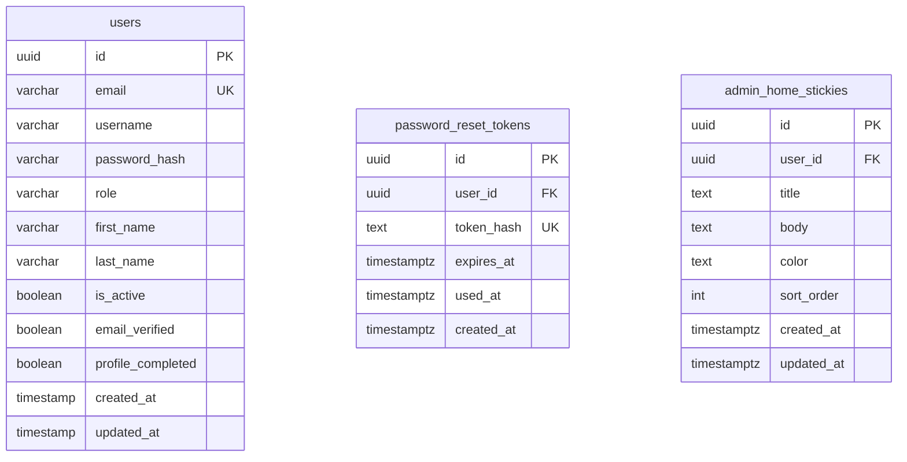

#### `users`

| Column | Type | Keys |
| --- | --- | --- |
| `id` | uuid | PK |
| `email` | varchar(255)? | UK, null |
| `username` | varchar(100)? | null |
| `password_hash` | varchar(255) | — |
| `role` | varchar(20) | — |
| `first_name` | varchar(100) | — |
| `last_name` | varchar(100) | — |
| `is_active` | boolean? | null |
| `email_verified` | boolean? | null |
| `profile_completed` | boolean? | null |
| `created_at` | timestamp? | null |
| `updated_at` | timestamp? | null |

#### `password_reset_tokens`

| Column | Type | Keys |
| --- | --- | --- |
| `id` | uuid | PK |
| `user_id` | uuid | FK |
| `token_hash` | text | UK |
| `expires_at` | timestamptz | — |
| `used_at` | timestamptz? | null |
| `created_at` | timestamptz | — |

#### `admin_home_stickies`

| Column | Type | Keys |
| --- | --- | --- |
| `id` | uuid | PK |
| `user_id` | uuid | FK |
| `title` | text | — |
| `body` | text | — |
| `color` | text | — |
| `sort_order` | int | — |
| `created_at` | timestamptz | — |
| `updated_at` | timestamptz | — |

### People

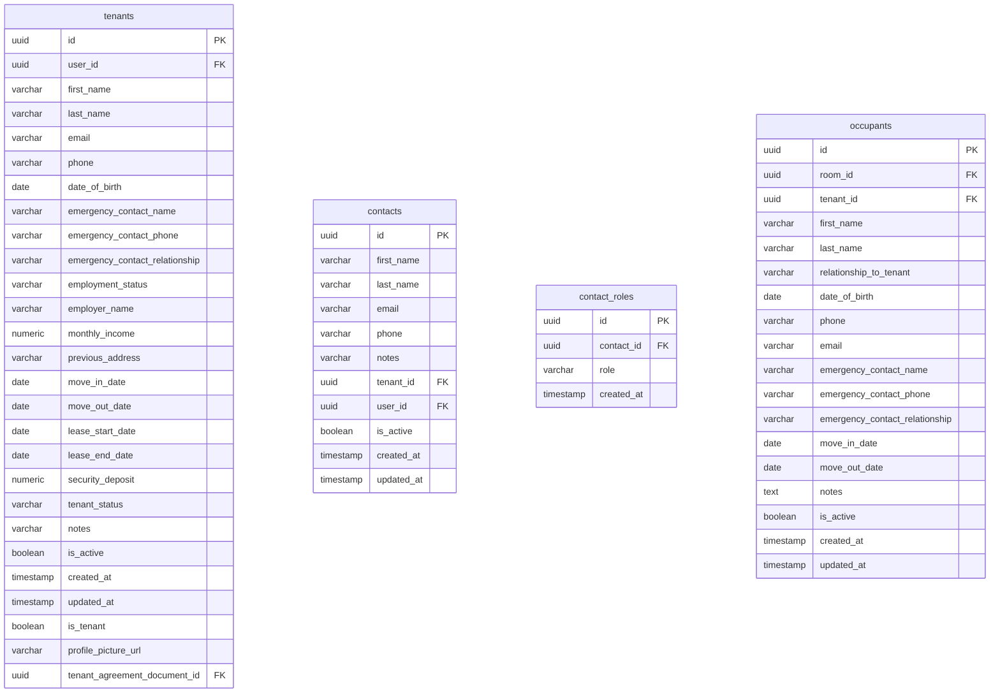

#### `tenants`

| Column | Type | Keys |
| --- | --- | --- |
| `id` | uuid | PK |
| `user_id` | uuid? | FK, null |
| `first_name` | varchar(100) | — |
| `last_name` | varchar(100) | — |
| `email` | varchar(255)? | null |
| `phone` | varchar(20)? | null |
| `date_of_birth` | date? | null |
| `emergency_contact_name` | varchar(255)? | null |
| `emergency_contact_phone` | varchar(20)? | null |
| `emergency_contact_relationship` | varchar(100)? | null |
| `employment_status` | varchar(50)? | null |
| `employer_name` | varchar(255)? | null |
| `monthly_income` | numeric(10,2)? | null |
| `previous_address` | varchar? | null |
| `move_in_date` | date? | null |
| `move_out_date` | date? | null |
| `lease_start_date` | date? | null |
| `lease_end_date` | date? | null |
| `security_deposit` | numeric(10,2)? | null |
| `tenant_status` | varchar(20)? | null |
| `notes` | varchar? | null |
| `is_active` | boolean? | null |
| `created_at` | timestamp? | null |
| `updated_at` | timestamp? | null |
| `is_tenant` | boolean | — |
| `profile_picture_url` | varchar(500)? | null |
| `tenant_agreement_document_id` | uuid? | FK, null |

#### `contacts`

| Column | Type | Keys |
| --- | --- | --- |
| `id` | uuid | PK |
| `first_name` | varchar(100) | — |
| `last_name` | varchar(100) | — |
| `email` | varchar(255)? | null |
| `phone` | varchar(20)? | null |
| `notes` | varchar? | null |
| `tenant_id` | uuid? | FK, null |
| `user_id` | uuid? | FK, null |
| `is_active` | boolean? | null |
| `created_at` | timestamp? | null |
| `updated_at` | timestamp? | null |

#### `contact_roles`

| Column | Type | Keys |
| --- | --- | --- |
| `id` | uuid | PK |
| `contact_id` | uuid | FK |
| `role` | varchar(20) | — |
| `created_at` | timestamp? | null |

#### `occupants`

| Column | Type | Keys |
| --- | --- | --- |
| `id` | uuid | PK |
| `room_id` | uuid | FK |
| `tenant_id` | uuid? | FK, null |
| `first_name` | varchar(100) | — |
| `last_name` | varchar(100) | — |
| `relationship_to_tenant` | varchar(100)? | null |
| `date_of_birth` | date? | null |
| `phone` | varchar(20)? | null |
| `email` | varchar(255)? | null |
| `emergency_contact_name` | varchar(255)? | null |
| `emergency_contact_phone` | varchar(20)? | null |
| `emergency_contact_relationship` | varchar(100)? | null |
| `move_in_date` | date | — |
| `move_out_date` | date? | null |
| `notes` | text? | null |
| `is_active` | boolean? | null |
| `created_at` | timestamp | — |
| `updated_at` | timestamp | — |

### Property

```mermaid
erDiagram
  buildings {
    uuid id PK
    varchar name
    varchar address_line1
    varchar address_line2
    varchar city
    varchar state
    varchar postal_code
    varchar country
    varchar description
    varchar building_type
    int year_built
    int total_floors
    int total_units
    varchararr amenities
    boolean is_active
    boolean auto_late_fee
    float latitude
    float longitude
    timestamptz geocoded_at
    boolean show_on_landing_nearby
    timestamp created_at
    timestamp updated_at
  }
  rooms {
    uuid id PK
    uuid building_id FK
    varchar room_number
    int floor_number
    varchar room_type
    numeric square_footage
    numeric monthly_rate
    numeric deposit_amount
    varchar room_status
    varchar description
    varchararr amenities
    boolean is_active
    boolean is_revenue_unit
    timestamp created_at
    timestamp updated_at
    boolean deposit_required
    varchar deposit_type
    numeric deposit_percentage
  }
  building_deposit_config {
    uuid id PK
    uuid building_id UK FK
    numeric deposit_months
    varchar deposit_type
    numeric deposit_amount
    numeric deposit_percentage
    numeric advance_months
    varchar advance_type
    numeric advance_amount
    numeric advance_percentage
    numeric utility_deposit_amount
    int deposit_validity_days
    int deposit_refundable_after_days
    numeric minimum_deposit_amount
    boolean is_active
    timestamp created_at
    timestamp updated_at
  }
  building_nearby_snapshots {
    uuid building_id PK FK
    float origin_latitude
    float origin_longitude
    jsonb places
    timestamptz fetched_at
    timestamptz created_at
    timestamptz updated_at
  }
  building_nearby_routes {
    uuid id PK
    uuid building_id FK
    text place_id
    varchar profile
    int distance_meters
    int duration_seconds
    jsonb geometry
    timestamptz fetched_at
  }
  address_regions {
    uuid id PK
    varchar country_code
    varchar code
    varchar name
    int sort_order
    boolean is_active
    timestamp created_at
    timestamp updated_at
  }
  address_cities {
    uuid id PK
    uuid region_id FK
    varchar code
    varchar name
    boolean is_active
    timestamp created_at
    timestamp updated_at
  }
```

#### `buildings`

| Column | Type | Keys |
| --- | --- | --- |
| `id` | uuid | PK |
| `name` | varchar(255) | — |
| `address_line1` | varchar(255) | — |
| `address_line2` | varchar(255)? | null |
| `city` | varchar(100) | — |
| `state` | varchar(50) | — |
| `postal_code` | varchar(20) | — |
| `country` | varchar(50)? | null |
| `description` | varchar? | null |
| `building_type` | varchar(50)? | null |
| `year_built` | int? | null |
| `total_floors` | int? | null |
| `total_units` | int? | null |
| `amenities` | varchar[] | — |
| `is_active` | boolean? | null |
| `auto_late_fee` | boolean | — |
| `latitude` | float? | null |
| `longitude` | float? | null |
| `geocoded_at` | timestamptz? | null |
| `show_on_landing_nearby` | boolean | — |
| `created_at` | timestamp? | null |
| `updated_at` | timestamp? | null |

#### `rooms`

| Column | Type | Keys |
| --- | --- | --- |
| `id` | uuid | PK |
| `building_id` | uuid | FK |
| `room_number` | varchar(50) | — |
| `floor_number` | int? | null |
| `room_type` | varchar(50)? | null |
| `square_footage` | numeric(8,2)? | null |
| `monthly_rate` | numeric(10,2) | — |
| `deposit_amount` | numeric(10,2)? | null |
| `room_status` | varchar(20)? | null |
| `description` | varchar? | null |
| `amenities` | varchar[] | — |
| `is_active` | boolean? | null |
| `is_revenue_unit` | boolean | — |
| `created_at` | timestamp? | null |
| `updated_at` | timestamp? | null |
| `deposit_required` | boolean? | null |
| `deposit_type` | varchar(20)? | null |
| `deposit_percentage` | numeric(5,2)? | null |

#### `building_deposit_config`

| Column | Type | Keys |
| --- | --- | --- |
| `id` | uuid | PK |
| `building_id` | uuid | UK, FK |
| `deposit_months` | numeric(4,2)? | null |
| `deposit_type` | varchar(20)? | null |
| `deposit_amount` | numeric(10,2)? | null |
| `deposit_percentage` | numeric(5,2)? | null |
| `advance_months` | numeric(4,2)? | null |
| `advance_type` | varchar(20)? | null |
| `advance_amount` | numeric(10,2)? | null |
| `advance_percentage` | numeric(5,2)? | null |
| `utility_deposit_amount` | numeric(10,2)? | null |
| `deposit_validity_days` | int? | null |
| `deposit_refundable_after_days` | int? | null |
| `minimum_deposit_amount` | numeric(10,2)? | null |
| `is_active` | boolean? | null |
| `created_at` | timestamp | — |
| `updated_at` | timestamp | — |

#### `building_nearby_snapshots`

| Column | Type | Keys |
| --- | --- | --- |
| `building_id` | uuid | PK, FK |
| `origin_latitude` | float | — |
| `origin_longitude` | float | — |
| `places` | jsonb | — |
| `fetched_at` | timestamptz | — |
| `created_at` | timestamptz | — |
| `updated_at` | timestamptz | — |

#### `building_nearby_routes`

| Column | Type | Keys |
| --- | --- | --- |
| `id` | uuid | PK |
| `building_id` | uuid | FK |
| `place_id` | text | — |
| `profile` | varchar(20) | — |
| `distance_meters` | int? | null |
| `duration_seconds` | int? | null |
| `geometry` | jsonb | — |
| `fetched_at` | timestamptz | — |

#### `address_regions`

| Column | Type | Keys |
| --- | --- | --- |
| `id` | uuid | PK |
| `country_code` | varchar(2) | — |
| `code` | varchar(20) | — |
| `name` | varchar(150) | — |
| `sort_order` | int | — |
| `is_active` | boolean | — |
| `created_at` | timestamp | — |
| `updated_at` | timestamp | — |

#### `address_cities`

| Column | Type | Keys |
| --- | --- | --- |
| `id` | uuid | PK |
| `region_id` | uuid | FK |
| `code` | varchar(20)? | null |
| `name` | varchar(150) | — |
| `is_active` | boolean | — |
| `created_at` | timestamp | — |
| `updated_at` | timestamp | — |

### Occupancy

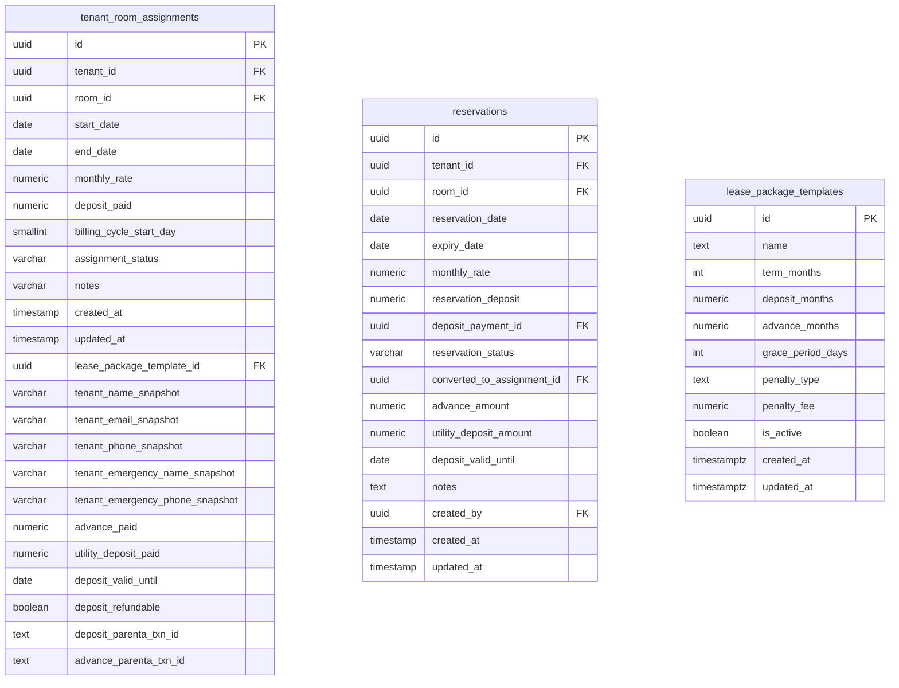

#### `tenant_room_assignments`

| Column | Type | Keys |
| --- | --- | --- |
| `id` | uuid | PK |
| `tenant_id` | uuid | FK |
| `room_id` | uuid | FK |
| `start_date` | date | — |
| `end_date` | date? | null |
| `monthly_rate` | numeric(10,2) | — |
| `deposit_paid` | numeric(10,2)? | null |
| `billing_cycle_start_day` | smallint? | null |
| `assignment_status` | varchar(20)? | null |
| `notes` | varchar? | null |
| `created_at` | timestamp? | null |
| `updated_at` | timestamp? | null |
| `lease_package_template_id` | uuid? | FK, null |
| `tenant_name_snapshot` | varchar(255)? | null |
| `tenant_email_snapshot` | varchar(255)? | null |
| `tenant_phone_snapshot` | varchar(50)? | null |
| `tenant_emergency_name_snapshot` | varchar(255)? | null |
| `tenant_emergency_phone_snapshot` | varchar(50)? | null |
| `advance_paid` | numeric(10,2)? | null |
| `utility_deposit_paid` | numeric(10,2)? | null |
| `deposit_valid_until` | date? | null |
| `deposit_refundable` | boolean? | null |
| `deposit_parenta_txn_id` | text? | null |
| `advance_parenta_txn_id` | text? | null |

#### `reservations`

| Column | Type | Keys |
| --- | --- | --- |
| `id` | uuid | PK |
| `tenant_id` | uuid | FK |
| `room_id` | uuid | FK |
| `reservation_date` | date | — |
| `expiry_date` | date | — |
| `monthly_rate` | numeric(10,2) | — |
| `reservation_deposit` | numeric(10,2)? | null |
| `deposit_payment_id` | uuid? | FK, null |
| `reservation_status` | varchar(20)? | null |
| `converted_to_assignment_id` | uuid? | FK, null |
| `advance_amount` | numeric(10,2)? | null |
| `utility_deposit_amount` | numeric(10,2)? | null |
| `deposit_valid_until` | date? | null |
| `notes` | text? | null |
| `created_by` | uuid? | FK, null |
| `created_at` | timestamp | — |
| `updated_at` | timestamp | — |

#### `lease_package_templates`

| Column | Type | Keys |
| --- | --- | --- |
| `id` | uuid | PK |
| `name` | text | — |
| `term_months` | int? | null |
| `deposit_months` | numeric(6,2)? | null |
| `advance_months` | numeric(6,2) | — |
| `grace_period_days` | int | — |
| `penalty_type` | text | — |
| `penalty_fee` | numeric(12,2) | — |
| `is_active` | boolean | — |
| `created_at` | timestamptz | — |
| `updated_at` | timestamptz | — |

### Billing

```mermaid
erDiagram
  invoices {
    uuid id PK
    uuid tenant_id FK
    varchar invoice_number UK
    date issue_date
    date due_date
    date negotiated_due_date
    varchar negotiated_due_reason
    date billing_period_start
    date billing_period_end
    numeric subtotal
    numeric tax_amount
    numeric discount_amount
    numeric adjustment_amount
    varchar adjustment_reason
    numeric total_amount
    numeric amount_paid
    numeric balance_due
    varchar invoice_status
    varchar bill_status
    varchar notes
    timestamp created_at
    timestamp updated_at
  }
  invoice_line_items {
    uuid id PK
    uuid invoice_id FK
    varchar description
    numeric quantity
    numeric unit_price
    numeric line_total
    varchar item_type
    timestamp created_at
  }
  payments {
    uuid id PK
    uuid tenant_id FK
    uuid room_id FK
    uuid assignment_id FK
    uuid asset_assignment_ids
    numeric amount
    varchar payment_type
    varchar payment_method
    date payment_date
    date due_date
    varchar payment_status
    varchar reference_number
    varchar or_number
    date or_date
    varchar notes
    timestamp created_at
    timestamp updated_at
    text parenta_txn_id
    varchar receipt_file_path
    timestamp receipt_uploaded_at
    varchar receipt_file_name
    int receipt_file_size
  }
  payment_allocations {
    uuid id PK
    uuid payment_id FK
    uuid invoice_id FK
    numeric allocated_amount
    timestamp allocation_date
    varchar notes
    timestamp created_at
  }
  payment_updates {
    uuid id PK
    uuid payment_id FK
    varchar author_role
    uuid author_user_id FK
    text author_name
    text body
    varchar update_type
    text photo_file_name
    text photo_file_path
    text photo_mime_type
    int photo_file_size
    timestamptz created_at
  }
  tenant_credits {
    uuid id PK
    uuid tenant_id FK
    numeric amount
    varchar source
    varchar description
    uuid payment_id FK
    uuid applied_to_invoice_id FK
    varchar status
    timestamp created_at
    timestamp updated_at
  }
  deposit_ledger {
    uuid id PK
    uuid tenant_id FK
    numeric amount
    varchar transaction_type
    uuid applied_to_invoice_id FK
    uuid payment_id FK
    varchar description
    date transaction_date
    uuid created_by
    timestamp created_at
    timestamp updated_at
  }
  txn_sequences {
    varchar txn_type PK
    smallint year_yy PK
    int last_value
    timestamp updated_at
  }
  expenses {
    uuid id PK
    uuid building_id FK
    uuid room_id FK
    uuid tenant_id FK
    uuid related_moveout_id FK
    uuid related_assignment_id FK
    varchar category
    varchar description
    numeric amount
    date expense_date
    varchar vendor_name
    varchar vendor_contact
    varchar payment_method
    varchar receipt_url
    varchar expense_status
    boolean is_recurring
    varchar recurrence_interval
    varchar notes
    timestamp created_at
    timestamp updated_at
    text parenta_txn_id
  }
  late_fee_settings {
    uuid id PK
    uuid building_id FK
    varchar name
    text description
    varchar fee_type
    numeric percentage_amount
    numeric flat_rate_amount
    int grace_period_days
    int apply_after_days
    boolean is_recurring
    int recurring_interval_days
    int max_occurrences
    numeric max_fee_amount
    numeric min_invoice_amount
    boolean is_active
    boolean auto_apply
    boolean send_notification
    uuid created_by FK
    timestamp created_at
    timestamp updated_at
  }
  late_fee_tiers {
    uuid id PK
    uuid late_fee_setting_id FK
    int min_days_overdue
    int max_days_overdue
    varchar fee_type
    numeric percentage_amount
    numeric flat_rate_amount
    int tier_order
    timestamp created_at
  }
  late_fee_applications {
    uuid id PK
    uuid invoice_id FK
    uuid tenant_id FK
    uuid late_fee_setting_id FK
    numeric fee_amount
    varchar calculation_method
    int days_overdue
    numeric original_amount
    varchar status
    timestamp applied_at
    timestamp waived_at
    uuid waived_by FK
    text waived_reason
    uuid late_fee_invoice_id FK
    timestamp created_at
    timestamp updated_at
  }
  collection_lifetime_totals {
    uuid id PK
    varchar scope_key UK
    uuid building_id FK
    numeric overall_collection
    date as_of_date
    date last_committed_period_start
    date last_committed_period_end
    timestamptz updated_at
  }
  collection_lifetime_period_commits {
    uuid id PK
    varchar scope_key
    uuid building_id FK
    date period_start
    date period_end
    numeric previous_total
    numeric period_collection
    numeric overall_collection
    timestamptz committed_at
  }
```

#### `invoices`

| Column | Type | Keys |
| --- | --- | --- |
| `id` | uuid | PK |
| `tenant_id` | uuid | FK |
| `invoice_number` | varchar(100) | UK |
| `issue_date` | date | — |
| `due_date` | date | — |
| `negotiated_due_date` | date? | null |
| `negotiated_due_reason` | varchar? | null |
| `billing_period_start` | date? | null |
| `billing_period_end` | date? | null |
| `subtotal` | numeric(10,2) | — |
| `tax_amount` | numeric(10,2) | — |
| `discount_amount` | numeric(10,2) | — |
| `adjustment_amount` | numeric(10,2) | — |
| `adjustment_reason` | varchar? | null |
| `total_amount` | numeric(10,2) | — |
| `amount_paid` | numeric(10,2) | — |
| `balance_due` | numeric(10,2)? | null |
| `invoice_status` | varchar(20)? | null |
| `bill_status` | varchar(20) | — |
| `notes` | varchar? | null |
| `created_at` | timestamp? | null |
| `updated_at` | timestamp? | null |

#### `invoice_line_items`

| Column | Type | Keys |
| --- | --- | --- |
| `id` | uuid | PK |
| `invoice_id` | uuid | FK |
| `description` | varchar(255) | — |
| `quantity` | numeric(10,2)? | null |
| `unit_price` | numeric(10,2) | — |
| `line_total` | numeric(10,2)? | null |
| `item_type` | varchar(50)? | null |
| `created_at` | timestamp? | null |

#### `payments`

| Column | Type | Keys |
| --- | --- | --- |
| `id` | uuid | PK |
| `tenant_id` | uuid | FK |
| `room_id` | uuid? | FK, null |
| `assignment_id` | uuid? | FK, null |
| `asset_assignment_ids` | uuid | — |
| `amount` | numeric(10,2) | — |
| `payment_type` | varchar(50) | — |
| `payment_method` | varchar(50)? | null |
| `payment_date` | date | — |
| `due_date` | date | — |
| `payment_status` | varchar(20)? | null |
| `reference_number` | varchar(100)? | null |
| `or_number` | varchar(100)? | null |
| `or_date` | date? | null |
| `notes` | varchar? | null |
| `created_at` | timestamp? | null |
| `updated_at` | timestamp? | null |
| `parenta_txn_id` | text? | null |
| `receipt_file_path` | varchar(500)? | null |
| `receipt_uploaded_at` | timestamp? | null |
| `receipt_file_name` | varchar(255)? | null |
| `receipt_file_size` | int? | null |

#### `payment_allocations`

| Column | Type | Keys |
| --- | --- | --- |
| `id` | uuid | PK |
| `payment_id` | uuid | FK |
| `invoice_id` | uuid | FK |
| `allocated_amount` | numeric(10,2) | — |
| `allocation_date` | timestamp? | null |
| `notes` | varchar? | null |
| `created_at` | timestamp? | null |

#### `payment_updates`

| Column | Type | Keys |
| --- | --- | --- |
| `id` | uuid | PK |
| `payment_id` | uuid | FK |
| `author_role` | varchar(20) | — |
| `author_user_id` | uuid? | FK, null |
| `author_name` | text? | null |
| `body` | text | — |
| `update_type` | varchar(30) | — |
| `photo_file_name` | text? | null |
| `photo_file_path` | text? | null |
| `photo_mime_type` | text? | null |
| `photo_file_size` | int? | null |
| `created_at` | timestamptz | — |

#### `tenant_credits`

| Column | Type | Keys |
| --- | --- | --- |
| `id` | uuid | PK |
| `tenant_id` | uuid | FK |
| `amount` | numeric(10,2) | — |
| `source` | varchar(50) | — |
| `description` | varchar? | null |
| `payment_id` | uuid? | FK, null |
| `applied_to_invoice_id` | uuid? | FK, null |
| `status` | varchar(20)? | null |
| `created_at` | timestamp? | null |
| `updated_at` | timestamp? | null |

#### `deposit_ledger`

| Column | Type | Keys |
| --- | --- | --- |
| `id` | uuid | PK |
| `tenant_id` | uuid | FK |
| `amount` | numeric(10,2) | — |
| `transaction_type` | varchar(20) | — |
| `applied_to_invoice_id` | uuid? | FK, null |
| `payment_id` | uuid? | FK, null |
| `description` | varchar? | null |
| `transaction_date` | date | — |
| `created_by` | uuid? | null |
| `created_at` | timestamp? | null |
| `updated_at` | timestamp? | null |

#### `txn_sequences`

| Column | Type | Keys |
| --- | --- | --- |
| `txn_type` | varchar(8) | PK |
| `year_yy` | smallint | PK |
| `last_value` | int | — |
| `updated_at` | timestamp | — |

#### `expenses`

| Column | Type | Keys |
| --- | --- | --- |
| `id` | uuid | PK |
| `building_id` | uuid? | FK, null |
| `room_id` | uuid? | FK, null |
| `tenant_id` | uuid? | FK, null |
| `related_moveout_id` | uuid? | FK, null |
| `related_assignment_id` | uuid? | FK, null |
| `category` | varchar(100) | — |
| `description` | varchar(255) | — |
| `amount` | numeric(10,2) | — |
| `expense_date` | date | — |
| `vendor_name` | varchar(255)? | null |
| `vendor_contact` | varchar(255)? | null |
| `payment_method` | varchar(50)? | null |
| `receipt_url` | varchar(500)? | null |
| `expense_status` | varchar(20)? | null |
| `is_recurring` | boolean? | null |
| `recurrence_interval` | varchar(20)? | null |
| `notes` | varchar? | null |
| `created_at` | timestamp? | null |
| `updated_at` | timestamp? | null |
| `parenta_txn_id` | text? | null |

#### `late_fee_settings`

| Column | Type | Keys |
| --- | --- | --- |
| `id` | uuid | PK |
| `building_id` | uuid? | FK, null |
| `name` | varchar(255) | — |
| `description` | text? | null |
| `fee_type` | varchar(20) | — |
| `percentage_amount` | numeric(5,2)? | null |
| `flat_rate_amount` | numeric(10,2)? | null |
| `grace_period_days` | int | — |
| `apply_after_days` | int | — |
| `is_recurring` | boolean? | null |
| `recurring_interval_days` | int? | null |
| `max_occurrences` | int? | null |
| `max_fee_amount` | numeric(10,2)? | null |
| `min_invoice_amount` | numeric(10,2)? | null |
| `is_active` | boolean? | null |
| `auto_apply` | boolean? | null |
| `send_notification` | boolean? | null |
| `created_by` | uuid? | FK, null |
| `created_at` | timestamp | — |
| `updated_at` | timestamp | — |

#### `late_fee_tiers`

| Column | Type | Keys |
| --- | --- | --- |
| `id` | uuid | PK |
| `late_fee_setting_id` | uuid | FK |
| `min_days_overdue` | int | — |
| `max_days_overdue` | int? | null |
| `fee_type` | varchar(20) | — |
| `percentage_amount` | numeric(5,2)? | null |
| `flat_rate_amount` | numeric(10,2)? | null |
| `tier_order` | int | — |
| `created_at` | timestamp | — |

#### `late_fee_applications`

| Column | Type | Keys |
| --- | --- | --- |
| `id` | uuid | PK |
| `invoice_id` | uuid | FK |
| `tenant_id` | uuid | FK |
| `late_fee_setting_id` | uuid | FK |
| `fee_amount` | numeric(10,2) | — |
| `calculation_method` | varchar(20) | — |
| `days_overdue` | int | — |
| `original_amount` | numeric(10,2) | — |
| `status` | varchar(20)? | null |
| `applied_at` | timestamp? | null |
| `waived_at` | timestamp? | null |
| `waived_by` | uuid? | FK, null |
| `waived_reason` | text? | null |
| `late_fee_invoice_id` | uuid? | FK, null |
| `created_at` | timestamp | — |
| `updated_at` | timestamp | — |

#### `collection_lifetime_totals`

| Column | Type | Keys |
| --- | --- | --- |
| `id` | uuid | PK |
| `scope_key` | varchar | UK |
| `building_id` | uuid? | FK, null |
| `overall_collection` | numeric(14,2) | — |
| `as_of_date` | date? | null |
| `last_committed_period_start` | date? | null |
| `last_committed_period_end` | date? | null |
| `updated_at` | timestamptz | — |

#### `collection_lifetime_period_commits`

| Column | Type | Keys |
| --- | --- | --- |
| `id` | uuid | PK |
| `scope_key` | varchar | — |
| `building_id` | uuid? | FK, null |
| `period_start` | date | — |
| `period_end` | date | — |
| `previous_total` | numeric(14,2) | — |
| `period_collection` | numeric(14,2) | — |
| `overall_collection` | numeric(14,2) | — |
| `committed_at` | timestamptz | — |

### Utilities

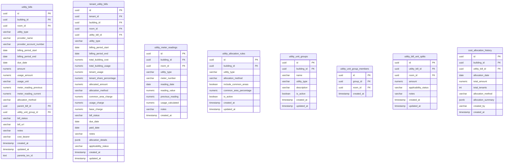

#### `utility_bills`

| Column | Type | Keys |
| --- | --- | --- |
| `id` | uuid | PK |
| `building_id` | uuid? | FK, null |
| `room_id` | uuid? | FK, null |
| `utility_type` | varchar(50) | — |
| `provider_name` | varchar(255) | — |
| `provider_account_number` | varchar(100)? | null |
| `billing_period_start` | date | — |
| `billing_period_end` | date | — |
| `due_date` | date | — |
| `amount` | numeric(10,2) | — |
| `usage_amount` | numeric(10,2)? | null |
| `usage_unit` | varchar(20)? | null |
| `meter_reading_previous` | numeric(12,2)? | null |
| `meter_reading_current` | numeric(12,2)? | null |
| `allocation_method` | varchar(30)? | null |
| `parent_bill_id` | uuid? | FK, null |
| `utility_unit_group_id` | uuid? | FK, null |
| `bill_status` | varchar(20)? | null |
| `bill_url` | varchar(500)? | null |
| `notes` | varchar? | null |
| `cost_bearer` | varchar(20) | — |
| `created_at` | timestamp? | null |
| `updated_at` | timestamp? | null |
| `parenta_txn_id` | text? | null |

#### `tenant_utility_bills`

| Column | Type | Keys |
| --- | --- | --- |
| `id` | uuid | PK |
| `tenant_id` | uuid | FK |
| `building_id` | uuid | FK |
| `room_id` | uuid? | FK, null |
| `utility_bill_id` | uuid? | FK, null |
| `utility_type` | varchar(50) | — |
| `billing_period_start` | date | — |
| `billing_period_end` | date | — |
| `total_building_cost` | numeric(10,2) | — |
| `total_building_usage` | numeric(10,2)? | null |
| `tenant_usage` | numeric(10,2)? | null |
| `tenant_share_percentage` | numeric(5,2) | — |
| `allocated_amount` | numeric(10,2) | — |
| `allocation_method` | varchar(20) | — |
| `common_area_charge` | numeric(10,2)? | null |
| `usage_charge` | numeric(10,2)? | null |
| `base_charge` | numeric(10,2)? | null |
| `bill_status` | varchar(20)? | null |
| `due_date` | date? | null |
| `paid_date` | date? | null |
| `notes` | varchar? | null |
| `allocation_details` | jsonb? | null |
| `applicability_status` | varchar(20) | — |
| `created_at` | timestamp? | null |
| `updated_at` | timestamp? | null |

#### `utility_meter_readings`

| Column | Type | Keys |
| --- | --- | --- |
| `id` | uuid | PK |
| `building_id` | uuid | FK |
| `room_id` | uuid? | FK, null |
| `utility_type` | varchar(50) | — |
| `meter_number` | varchar(100)? | null |
| `reading_date` | date | — |
| `reading_value` | numeric(10,2) | — |
| `previous_reading` | numeric(10,2)? | null |
| `usage_calculated` | numeric(10,2)? | null |
| `notes` | varchar? | null |
| `created_at` | timestamp? | null |

#### `utility_allocation_rules`

| Column | Type | Keys |
| --- | --- | --- |
| `id` | uuid | PK |
| `building_id` | uuid | FK |
| `utility_type` | varchar(50) | — |
| `allocation_method` | varchar(20) | — |
| `include_common_areas` | boolean? | null |
| `common_area_percentage` | numeric(5,2)? | null |
| `is_active` | boolean? | null |
| `created_at` | timestamp? | null |
| `updated_at` | timestamp? | null |

#### `utility_unit_groups`

| Column | Type | Keys |
| --- | --- | --- |
| `id` | uuid | PK |
| `building_id` | uuid | FK |
| `name` | varchar(100) | — |
| `utility_type` | varchar(50)? | null |
| `description` | varchar? | null |
| `is_active` | boolean? | null |
| `created_at` | timestamp? | null |
| `updated_at` | timestamp? | null |

#### `utility_unit_group_members`

| Column | Type | Keys |
| --- | --- | --- |
| `id` | uuid | PK |
| `group_id` | uuid | FK |
| `room_id` | uuid | FK |
| `created_at` | timestamp? | null |

#### `utility_bill_unit_splits`

| Column | Type | Keys |
| --- | --- | --- |
| `id` | uuid | PK |
| `utility_bill_id` | uuid | FK |
| `room_id` | uuid | FK |
| `amount` | numeric(10,2)? | null |
| `applicability_status` | varchar(20) | — |
| `notes` | varchar? | null |
| `created_at` | timestamp? | null |
| `updated_at` | timestamp? | null |

#### `cost_allocation_history`

| Column | Type | Keys |
| --- | --- | --- |
| `id` | uuid | PK |
| `building_id` | uuid | FK |
| `utility_bill_id` | uuid | FK |
| `allocation_date` | date | — |
| `total_amount` | numeric(10,2) | — |
| `total_tenants` | int | — |
| `allocation_method` | varchar(20) | — |
| `allocation_summary` | jsonb | — |
| `created_by` | varchar(255)? | null |
| `created_at` | timestamp? | null |

### Assets

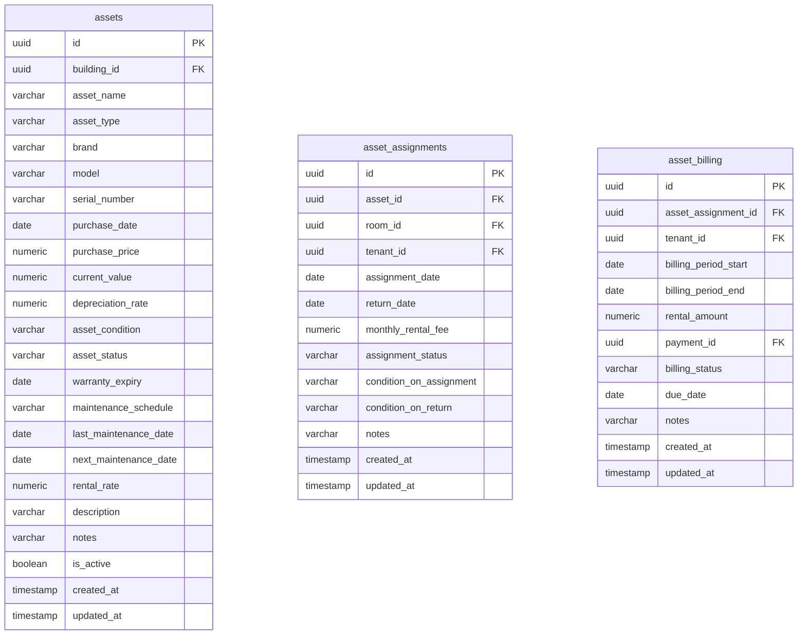

#### `assets`

| Column | Type | Keys |
| --- | --- | --- |
| `id` | uuid | PK |
| `building_id` | uuid? | FK, null |
| `asset_name` | varchar(255) | — |
| `asset_type` | varchar(100) | — |
| `brand` | varchar(100)? | null |
| `model` | varchar(100)? | null |
| `serial_number` | varchar(100)? | null |
| `purchase_date` | date? | null |
| `purchase_price` | numeric(10,2)? | null |
| `current_value` | numeric(10,2)? | null |
| `depreciation_rate` | numeric(5,2)? | null |
| `asset_condition` | varchar(50)? | null |
| `asset_status` | varchar(20)? | null |
| `warranty_expiry` | date? | null |
| `maintenance_schedule` | varchar(100)? | null |
| `last_maintenance_date` | date? | null |
| `next_maintenance_date` | date? | null |
| `rental_rate` | numeric(10,2)? | null |
| `description` | varchar? | null |
| `notes` | varchar? | null |
| `is_active` | boolean? | null |
| `created_at` | timestamp? | null |
| `updated_at` | timestamp? | null |

#### `asset_assignments`

| Column | Type | Keys |
| --- | --- | --- |
| `id` | uuid | PK |
| `asset_id` | uuid | FK |
| `room_id` | uuid? | FK, null |
| `tenant_id` | uuid? | FK, null |
| `assignment_date` | date | — |
| `return_date` | date? | null |
| `monthly_rental_fee` | numeric(10,2)? | null |
| `assignment_status` | varchar(20)? | null |
| `condition_on_assignment` | varchar(50)? | null |
| `condition_on_return` | varchar(50)? | null |
| `notes` | varchar? | null |
| `created_at` | timestamp? | null |
| `updated_at` | timestamp? | null |

#### `asset_billing`

| Column | Type | Keys |
| --- | --- | --- |
| `id` | uuid | PK |
| `asset_assignment_id` | uuid | FK |
| `tenant_id` | uuid | FK |
| `billing_period_start` | date | — |
| `billing_period_end` | date | — |
| `rental_amount` | numeric(10,2) | — |
| `payment_id` | uuid? | FK, null |
| `billing_status` | varchar(20)? | null |
| `due_date` | date? | null |
| `notes` | varchar? | null |
| `created_at` | timestamp? | null |
| `updated_at` | timestamp? | null |

### Documents

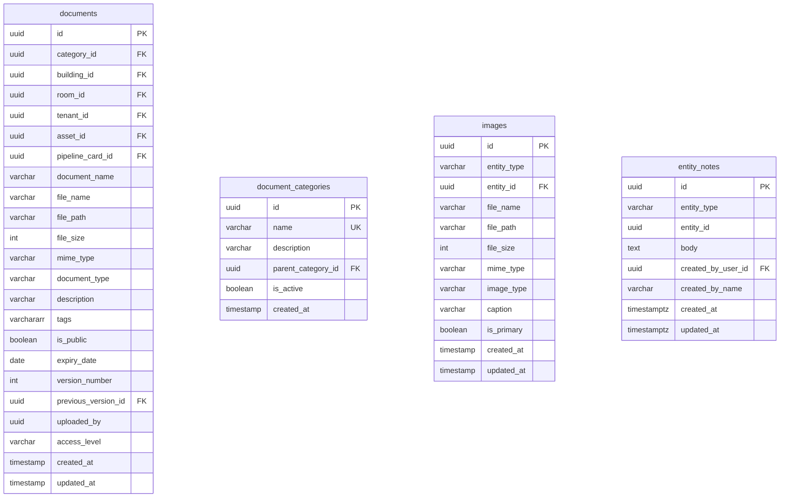

#### `documents`

| Column | Type | Keys |
| --- | --- | --- |
| `id` | uuid | PK |
| `category_id` | uuid? | FK, null |
| `building_id` | uuid? | FK, null |
| `room_id` | uuid? | FK, null |
| `tenant_id` | uuid? | FK, null |
| `asset_id` | uuid? | FK, null |
| `pipeline_card_id` | uuid? | FK, null |
| `document_name` | varchar(255) | — |
| `file_name` | varchar(255) | — |
| `file_path` | varchar(500) | — |
| `file_size` | int? | null |
| `mime_type` | varchar(100)? | null |
| `document_type` | varchar(100)? | null |
| `description` | varchar? | null |
| `tags` | varchar[] | — |
| `is_public` | boolean? | null |
| `expiry_date` | date? | null |
| `version_number` | int? | null |
| `previous_version_id` | uuid? | FK, null |
| `uploaded_by` | uuid? | null |
| `access_level` | varchar(20)? | null |
| `created_at` | timestamp? | null |
| `updated_at` | timestamp? | null |

#### `document_categories`

| Column | Type | Keys |
| --- | --- | --- |
| `id` | uuid | PK |
| `name` | varchar(100) | UK |
| `description` | varchar? | null |
| `parent_category_id` | uuid? | FK, null |
| `is_active` | boolean? | null |
| `created_at` | timestamp? | null |

#### `images`

| Column | Type | Keys |
| --- | --- | --- |
| `id` | uuid | PK |
| `entity_type` | varchar(20) | — |
| `entity_id` | uuid | FK |
| `file_name` | varchar(255) | — |
| `file_path` | varchar(500) | — |
| `file_size` | int | — |
| `mime_type` | varchar(100) | — |
| `image_type` | varchar(50)? | null |
| `caption` | varchar? | null |
| `is_primary` | boolean? | null |
| `created_at` | timestamp? | null |
| `updated_at` | timestamp? | null |

#### `entity_notes`

| Column | Type | Keys |
| --- | --- | --- |
| `id` | uuid | PK |
| `entity_type` | varchar(30) | — |
| `entity_id` | uuid | — |
| `body` | text | — |
| `created_by_user_id` | uuid? | FK, null |
| `created_by_name` | varchar(200)? | null |
| `created_at` | timestamptz | — |
| `updated_at` | timestamptz | — |

### Leasing

```mermaid
erDiagram
  lease_templates {
    uuid id PK
    uuid building_id FK
    varchar name
    text description
    varchar status
    int version
    varchar signature_method
    boolean require_witness
    boolean audit_ip
    boolean audit_timestamp
    boolean audit_user_agent
    boolean is_system
    timestamptz published_at
    uuid created_by FK
    uuid updated_by FK
    timestamptz created_at
    timestamptz updated_at
  }
  lease_template_sections {
    uuid id PK
    uuid template_id FK
    varchar section_key
    varchar title
    text body
    int sort_order
    boolean is_enabled
    varchar condition_key
    timestamptz created_at
    timestamptz updated_at
  }
  lease_agreement_snapshots {
    uuid id PK
    uuid document_id UK FK
    uuid template_id FK
    int template_version
    varchar template_name
    text resolved_html
    jsonb context_json
    jsonb sections_json
    timestamptz created_at
  }
  lease_signature_events {
    uuid id PK
    uuid document_id FK
    varchar signer_role
    varchar signer_name
    varchar signer_email
    varchar signature_method
    text signature_payload
    varchar typed_name
    varchar ip_address
    text user_agent
    timestamptz signed_at
    timestamptz created_at
  }
  lease_renewal_requests {
    uuid id PK
    uuid tenant_id FK
    uuid room_assignment_id FK
    date current_lease_end_date
    numeric current_monthly_rent
    date proposed_lease_start_date
    date proposed_lease_end_date
    numeric proposed_monthly_rent
    numeric proposed_deposit_amount
    text terms
    text admin_notes
    text tenant_notes
    varchar status
    uuid requested_by FK
    uuid approved_by FK
    timestamp approved_at
    text rejection_reason
    timestamp created_at
    timestamp updated_at
  }
  lease_expiration_alerts {
    uuid id PK
    uuid tenant_id FK
    uuid room_assignment_id FK
    date lease_end_date
    int days_until_expiry
    varchar alert_type
    varchar status
    timestamp sent_at
    timestamp acknowledged_at
    uuid acknowledged_by FK
    varchar action_taken
    text action_notes
    timestamp created_at
    timestamp updated_at
  }
  moveout_processing {
    uuid id PK
    uuid tenant_id FK
    uuid room_assignment_id FK
    date moveout_date
    date notice_date
    date actual_moveout_date
    date inspection_scheduled_date
    date inspection_completed_date
    text inspection_notes
    boolean inspection_passed
    uuid final_invoice_id FK
    numeric deposit_return_amount
    numeric deposit_deduction_amount
    text deduction_reason
    numeric advance_return_amount
    numeric utility_deposit_return_amount
    boolean settlement_completed
    date settlement_date
    text forwarding_address
    varchar forwarding_city
    varchar forwarding_postal_code
    varchar forwarding_country
    varchar status
    uuid assigned_to FK
    uuid created_by FK
    timestamp created_at
    timestamp updated_at
    timestamp completed_at
  }
  moveout_inspection_checklist_templates {
    uuid id PK
    uuid building_id FK
    int sort_order
    varchar item_key
    varchar label
    varchar category
    boolean is_active
    timestamptz created_at
    timestamptz updated_at
  }
  moveout_inspection_items {
    uuid id PK
    uuid moveout_id FK
    uuid template_id FK
    int sort_order
    varchar item_key
    varchar label
    varchar category
    varchar finding_status
    numeric deduction_amount
    text notes
    text photo_url
    timestamptz inspected_at
    timestamptz created_at
    timestamptz updated_at
  }
```

#### `lease_templates`

| Column | Type | Keys |
| --- | --- | --- |
| `id` | uuid | PK |
| `building_id` | uuid? | FK, null |
| `name` | varchar(255) | — |
| `description` | text? | null |
| `status` | varchar(20) | — |
| `version` | int | — |
| `signature_method` | varchar(30) | — |
| `require_witness` | boolean | — |
| `audit_ip` | boolean | — |
| `audit_timestamp` | boolean | — |
| `audit_user_agent` | boolean | — |
| `is_system` | boolean | — |
| `published_at` | timestamptz? | null |
| `created_by` | uuid? | FK, null |
| `updated_by` | uuid? | FK, null |
| `created_at` | timestamptz | — |
| `updated_at` | timestamptz | — |

#### `lease_template_sections`

| Column | Type | Keys |
| --- | --- | --- |
| `id` | uuid | PK |
| `template_id` | uuid | FK |
| `section_key` | varchar(80) | — |
| `title` | varchar(255) | — |
| `body` | text | — |
| `sort_order` | int | — |
| `is_enabled` | boolean | — |
| `condition_key` | varchar(80)? | null |
| `created_at` | timestamptz | — |
| `updated_at` | timestamptz | — |

#### `lease_agreement_snapshots`

| Column | Type | Keys |
| --- | --- | --- |
| `id` | uuid | PK |
| `document_id` | uuid | UK, FK |
| `template_id` | uuid? | FK, null |
| `template_version` | int? | null |
| `template_name` | varchar(255)? | null |
| `resolved_html` | text | — |
| `context_json` | jsonb | — |
| `sections_json` | jsonb | — |
| `created_at` | timestamptz | — |

#### `lease_signature_events`

| Column | Type | Keys |
| --- | --- | --- |
| `id` | uuid | PK |
| `document_id` | uuid | FK |
| `signer_role` | varchar(30) | — |
| `signer_name` | varchar(255) | — |
| `signer_email` | varchar(255)? | null |
| `signature_method` | varchar(30) | — |
| `signature_payload` | text? | null |
| `typed_name` | varchar(255)? | null |
| `ip_address` | varchar(64)? | null |
| `user_agent` | text? | null |
| `signed_at` | timestamptz | — |
| `created_at` | timestamptz | — |

#### `lease_renewal_requests`

| Column | Type | Keys |
| --- | --- | --- |
| `id` | uuid | PK |
| `tenant_id` | uuid | FK |
| `room_assignment_id` | uuid | FK |
| `current_lease_end_date` | date | — |
| `current_monthly_rent` | numeric(10,2) | — |
| `proposed_lease_start_date` | date | — |
| `proposed_lease_end_date` | date | — |
| `proposed_monthly_rent` | numeric(10,2) | — |
| `proposed_deposit_amount` | numeric(10,2)? | null |
| `terms` | text? | null |
| `admin_notes` | text? | null |
| `tenant_notes` | text? | null |
| `status` | varchar(20)? | null |
| `requested_by` | uuid? | FK, null |
| `approved_by` | uuid? | FK, null |
| `approved_at` | timestamp? | null |
| `rejection_reason` | text? | null |
| `created_at` | timestamp | — |
| `updated_at` | timestamp | — |

#### `lease_expiration_alerts`

| Column | Type | Keys |
| --- | --- | --- |
| `id` | uuid | PK |
| `tenant_id` | uuid | FK |
| `room_assignment_id` | uuid | FK |
| `lease_end_date` | date | — |
| `days_until_expiry` | int | — |
| `alert_type` | varchar(20) | — |
| `status` | varchar(20)? | null |
| `sent_at` | timestamp? | null |
| `acknowledged_at` | timestamp? | null |
| `acknowledged_by` | uuid? | FK, null |
| `action_taken` | varchar(50)? | null |
| `action_notes` | text? | null |
| `created_at` | timestamp | — |
| `updated_at` | timestamp | — |

#### `moveout_processing`

| Column | Type | Keys |
| --- | --- | --- |
| `id` | uuid | PK |
| `tenant_id` | uuid | FK |
| `room_assignment_id` | uuid | FK |
| `moveout_date` | date | — |
| `notice_date` | date? | null |
| `actual_moveout_date` | date? | null |
| `inspection_scheduled_date` | date? | null |
| `inspection_completed_date` | date? | null |
| `inspection_notes` | text? | null |
| `inspection_passed` | boolean? | null |
| `final_invoice_id` | uuid? | FK, null |
| `deposit_return_amount` | numeric(10,2)? | null |
| `deposit_deduction_amount` | numeric(10,2)? | null |
| `deduction_reason` | text? | null |
| `advance_return_amount` | numeric(10,2)? | null |
| `utility_deposit_return_amount` | numeric(10,2)? | null |
| `settlement_completed` | boolean? | null |
| `settlement_date` | date? | null |
| `forwarding_address` | text? | null |
| `forwarding_city` | varchar(100)? | null |
| `forwarding_postal_code` | varchar(20)? | null |
| `forwarding_country` | varchar(100)? | null |
| `status` | varchar(20)? | null |
| `assigned_to` | uuid? | FK, null |
| `created_by` | uuid? | FK, null |
| `created_at` | timestamp | — |
| `updated_at` | timestamp | — |
| `completed_at` | timestamp? | null |

#### `moveout_inspection_checklist_templates`

| Column | Type | Keys |
| --- | --- | --- |
| `id` | uuid | PK |
| `building_id` | uuid? | FK, null |
| `sort_order` | int | — |
| `item_key` | varchar(50) | — |
| `label` | varchar(255) | — |
| `category` | varchar(50) | — |
| `is_active` | boolean | — |
| `created_at` | timestamptz | — |
| `updated_at` | timestamptz | — |

#### `moveout_inspection_items`

| Column | Type | Keys |
| --- | --- | --- |
| `id` | uuid | PK |
| `moveout_id` | uuid | FK |
| `template_id` | uuid? | FK, null |
| `sort_order` | int | — |
| `item_key` | varchar(50) | — |
| `label` | varchar(255) | — |
| `category` | varchar(50) | — |
| `finding_status` | varchar(20) | — |
| `deduction_amount` | numeric(10,2) | — |
| `notes` | text? | null |
| `photo_url` | text? | null |
| `inspected_at` | timestamptz? | null |
| `created_at` | timestamptz | — |
| `updated_at` | timestamptz | — |

### Pipeline

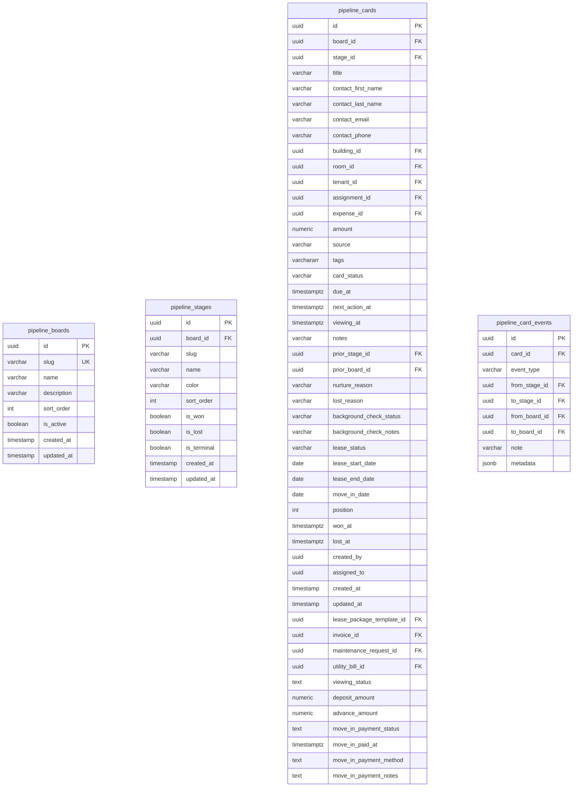

#### `pipeline_boards`

| Column | Type | Keys |
| --- | --- | --- |
| `id` | uuid | PK |
| `slug` | varchar(50) | UK |
| `name` | varchar(100) | — |
| `description` | varchar? | null |
| `sort_order` | int | — |
| `is_active` | boolean | — |
| `created_at` | timestamp? | null |
| `updated_at` | timestamp? | null |

#### `pipeline_stages`

| Column | Type | Keys |
| --- | --- | --- |
| `id` | uuid | PK |
| `board_id` | uuid | FK |
| `slug` | varchar(50) | — |
| `name` | varchar(100) | — |
| `color` | varchar(20) | — |
| `sort_order` | int | — |
| `is_won` | boolean | — |
| `is_lost` | boolean | — |
| `is_terminal` | boolean | — |
| `created_at` | timestamp? | null |
| `updated_at` | timestamp? | null |

#### `pipeline_cards`

| Column | Type | Keys |
| --- | --- | --- |
| `id` | uuid | PK |
| `board_id` | uuid | FK |
| `stage_id` | uuid | FK |
| `title` | varchar(255) | — |
| `contact_first_name` | varchar(100)? | null |
| `contact_last_name` | varchar(100)? | null |
| `contact_email` | varchar(255)? | null |
| `contact_phone` | varchar(20)? | null |
| `building_id` | uuid? | FK, null |
| `room_id` | uuid? | FK, null |
| `tenant_id` | uuid? | FK, null |
| `assignment_id` | uuid? | FK, null |
| `expense_id` | uuid? | FK, null |
| `amount` | numeric(10,2)? | null |
| `source` | varchar(100)? | null |
| `tags` | varchar[] | — |
| `card_status` | varchar(20) | — |
| `due_at` | timestamptz? | null |
| `next_action_at` | timestamptz? | null |
| `viewing_at` | timestamptz? | null |
| `notes` | varchar? | null |
| `prior_stage_id` | uuid? | FK, null |
| `prior_board_id` | uuid? | FK, null |
| `nurture_reason` | varchar(100)? | null |
| `lost_reason` | varchar? | null |
| `background_check_status` | varchar(30) | — |
| `background_check_notes` | varchar? | null |
| `lease_status` | varchar(30) | — |
| `lease_start_date` | date? | null |
| `lease_end_date` | date? | null |
| `move_in_date` | date? | null |
| `position` | int | — |
| `won_at` | timestamptz? | null |
| `lost_at` | timestamptz? | null |
| `created_by` | uuid? | null |
| `assigned_to` | uuid? | null |
| `created_at` | timestamp? | null |
| `updated_at` | timestamp? | null |
| `lease_package_template_id` | uuid? | FK, null |
| `invoice_id` | uuid? | FK, null |
| `maintenance_request_id` | uuid? | FK, null |
| `utility_bill_id` | uuid? | FK, null |
| `viewing_status` | text? | null |
| `deposit_amount` | numeric(12,2)? | null |
| `advance_amount` | numeric(12,2)? | null |
| `move_in_payment_status` | text | — |
| `move_in_paid_at` | timestamptz? | null |
| `move_in_payment_method` | text? | null |
| `move_in_payment_notes` | text? | null |

#### `pipeline_card_events`

| Column | Type | Keys |
| --- | --- | --- |
| `id` | uuid | PK |
| `card_id` | uuid | FK |
| `event_type` | varchar(50) | — |
| `from_stage_id` | uuid? | FK, null |
| `to_stage_id` | uuid? | FK, null |
| `from_board_id` | uuid? | FK, null |
| `to_board_id` | uuid? | FK, null |
| `note` | varchar? | null |
| `metadata` | jsonb? | null |

### Maintenance

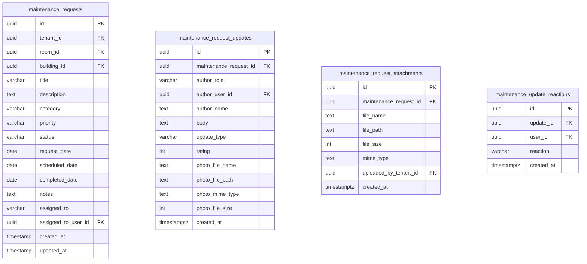

#### `maintenance_requests`

| Column | Type | Keys |
| --- | --- | --- |
| `id` | uuid | PK |
| `tenant_id` | uuid | FK |
| `room_id` | uuid? | FK, null |
| `building_id` | uuid? | FK, null |
| `title` | varchar(255) | — |
| `description` | text | — |
| `category` | varchar(100) | — |
| `priority` | varchar(20)? | null |
| `status` | varchar(30)? | null |
| `request_date` | date? | null |
| `scheduled_date` | date? | null |
| `completed_date` | date? | null |
| `notes` | text? | null |
| `assigned_to` | varchar(255)? | null |
| `assigned_to_user_id` | uuid? | FK, null |
| `created_at` | timestamp | — |
| `updated_at` | timestamp | — |

#### `maintenance_request_updates`

| Column | Type | Keys |
| --- | --- | --- |
| `id` | uuid | PK |
| `maintenance_request_id` | uuid | FK |
| `author_role` | varchar(20) | — |
| `author_user_id` | uuid? | FK, null |
| `author_name` | text? | null |
| `body` | text | — |
| `update_type` | varchar(30) | — |
| `rating` | int? | null |
| `photo_file_name` | text? | null |
| `photo_file_path` | text? | null |
| `photo_mime_type` | text? | null |
| `photo_file_size` | int? | null |
| `created_at` | timestamptz | — |

#### `maintenance_request_attachments`

| Column | Type | Keys |
| --- | --- | --- |
| `id` | uuid | PK |
| `maintenance_request_id` | uuid | FK |
| `file_name` | text | — |
| `file_path` | text | — |
| `file_size` | int? | null |
| `mime_type` | text? | null |
| `uploaded_by_tenant_id` | uuid? | FK, null |
| `created_at` | timestamptz | — |

#### `maintenance_update_reactions`

| Column | Type | Keys |
| --- | --- | --- |
| `id` | uuid | PK |
| `update_id` | uuid | FK |
| `user_id` | uuid | FK |
| `reaction` | varchar(20) | — |
| `created_at` | timestamptz | — |

### Comms

```mermaid
erDiagram
  communications {
    uuid id PK
    uuid tenant_id FK
    uuid user_id FK
    varchar communication_type
    varchar subject
    varchar message
    varchar direction
    timestamp communication_date
    boolean follow_up_required
    date follow_up_date
    varchar priority
    varchar status
    timestamp created_at
  }
  notifications {
    uuid id PK
    uuid user_id FK
    uuid tenant_id FK
    varchar notification_type
    varchar title
    varchar message
    varchar priority
    boolean is_read
    timestamp read_at
    timestamp scheduled_for
    timestamp sent_at
    varchar notification_status
    timestamp created_at
    varchar category
    text link
    uuid related_activity_log_id FK
  }
  notification_preferences {
    uuid id PK
    uuid user_id FK
    varchar category
    boolean in_app_enabled
    boolean email_enabled
    timestamptz updated_at
  }
  notification_templates {
    uuid id PK
    varchar name UK
    varchar subject
    text body_html
    text body_text
    varchar type
    jsonb variables
    boolean is_active
    boolean is_system
    uuid created_by FK
    timestamp created_at
    timestamp updated_at
  }
  notification_settings {
    uuid id PK
    uuid building_id FK
    varchar notification_type
    boolean enabled
    int days_before_due
    int days_after_due
    boolean is_recurring
    int recurring_interval_days
    int max_occurrences
    uuid template_id FK
    boolean send_to_tenant
    boolean send_to_admin
    varchar admin_email
    timestamp created_at
    timestamp updated_at
  }
  notification_queue {
    uuid id PK
    varchar recipient_email
    varchar recipient_name
    uuid tenant_id FK
    varchar notification_type
    uuid template_id FK
    varchar subject
    text body_html
    text body_text
    jsonb context_data
    varchar status
    timestamp scheduled_for
    timestamp sent_at
    text error_message
    int retry_count
    int max_retries
    varchar provider
    varchar provider_message_id
    timestamp created_at
    timestamp updated_at
  }
  notification_history {
    uuid id PK
    varchar recipient_email
    varchar recipient_name
    uuid tenant_id FK
    varchar notification_type
    uuid template_id FK
    varchar subject
    varchar status
    jsonb context_data
    varchar provider
    varchar provider_message_id
    text error_message
    timestamp sent_at
    timestamp created_at
  }
  scheduled_reminders {
    uuid id PK
    uuid tenant_id FK
    uuid invoice_id FK
    varchar reminder_type
    date scheduled_date
    timestamp sent_date
    varchar status
    int occurrence_number
    uuid notification_setting_id FK
    timestamp created_at
    timestamp updated_at
  }
  activity_log {
    uuid id PK
    uuid actor_user_id FK
    varchar actor_role
    varchar action_type
    varchar category
    varchar entity_type
    uuid entity_id
    varchar entity_label
    jsonb before_data
    jsonb after_data
    jsonb metadata
    timestamptz created_at
  }
  audit_logs {
    uuid id PK
    uuid user_id FK
    varchar table_name
    uuid record_id FK
    varchar action
    jsonb old_values
    jsonb new_values
    inet ip_address
    varchar user_agent
    timestamp created_at
  }
```

#### `communications`

| Column | Type | Keys |
| --- | --- | --- |
| `id` | uuid | PK |
| `tenant_id` | uuid? | FK, null |
| `user_id` | uuid? | FK, null |
| `communication_type` | varchar(50) | — |
| `subject` | varchar(255)? | null |
| `message` | varchar | — |
| `direction` | varchar(20) | — |
| `communication_date` | timestamp? | null |
| `follow_up_required` | boolean? | null |
| `follow_up_date` | date? | null |
| `priority` | varchar(20)? | null |
| `status` | varchar(20)? | null |
| `created_at` | timestamp? | null |

#### `notifications`

| Column | Type | Keys |
| --- | --- | --- |
| `id` | uuid | PK |
| `user_id` | uuid | FK |
| `tenant_id` | uuid? | FK, null |
| `notification_type` | varchar(50) | — |
| `title` | varchar(255) | — |
| `message` | varchar | — |
| `priority` | varchar(20)? | null |
| `is_read` | boolean? | null |
| `read_at` | timestamp? | null |
| `scheduled_for` | timestamp? | null |
| `sent_at` | timestamp? | null |
| `notification_status` | varchar(20)? | null |
| `created_at` | timestamp? | null |
| `category` | varchar(40)? | null |
| `link` | text? | null |
| `related_activity_log_id` | uuid? | FK, null |

#### `notification_preferences`

| Column | Type | Keys |
| --- | --- | --- |
| `id` | uuid | PK |
| `user_id` | uuid | FK |
| `category` | varchar(40) | — |
| `in_app_enabled` | boolean | — |
| `email_enabled` | boolean | — |
| `updated_at` | timestamptz | — |

#### `notification_templates`

| Column | Type | Keys |
| --- | --- | --- |
| `id` | uuid | PK |
| `name` | varchar(255) | UK |
| `subject` | varchar(500) | — |
| `body_html` | text | — |
| `body_text` | text? | null |
| `type` | varchar(50) | — |
| `variables` | jsonb? | null |
| `is_active` | boolean? | null |
| `is_system` | boolean? | null |
| `created_by` | uuid? | FK, null |
| `created_at` | timestamp | — |
| `updated_at` | timestamp | — |

#### `notification_settings`

| Column | Type | Keys |
| --- | --- | --- |
| `id` | uuid | PK |
| `building_id` | uuid? | FK, null |
| `notification_type` | varchar(50) | — |
| `enabled` | boolean? | null |
| `days_before_due` | int? | null |
| `days_after_due` | int? | null |
| `is_recurring` | boolean? | null |
| `recurring_interval_days` | int? | null |
| `max_occurrences` | int? | null |
| `template_id` | uuid? | FK, null |
| `send_to_tenant` | boolean? | null |
| `send_to_admin` | boolean? | null |
| `admin_email` | varchar(255)? | null |
| `created_at` | timestamp | — |
| `updated_at` | timestamp | — |

#### `notification_queue`

| Column | Type | Keys |
| --- | --- | --- |
| `id` | uuid | PK |
| `recipient_email` | varchar(255) | — |
| `recipient_name` | varchar(255)? | null |
| `tenant_id` | uuid? | FK, null |
| `notification_type` | varchar(50) | — |
| `template_id` | uuid? | FK, null |
| `subject` | varchar(500) | — |
| `body_html` | text | — |
| `body_text` | text? | null |
| `context_data` | jsonb? | null |
| `status` | varchar(20)? | null |
| `scheduled_for` | timestamp? | null |
| `sent_at` | timestamp? | null |
| `error_message` | text? | null |
| `retry_count` | int? | null |
| `max_retries` | int? | null |
| `provider` | varchar(50)? | null |
| `provider_message_id` | varchar(255)? | null |
| `created_at` | timestamp | — |
| `updated_at` | timestamp | — |

#### `notification_history`

| Column | Type | Keys |
| --- | --- | --- |
| `id` | uuid | PK |
| `recipient_email` | varchar(255) | — |
| `recipient_name` | varchar(255)? | null |
| `tenant_id` | uuid? | FK, null |
| `notification_type` | varchar(50) | — |
| `template_id` | uuid? | FK, null |
| `subject` | varchar(500) | — |
| `status` | varchar(20) | — |
| `context_data` | jsonb? | null |
| `provider` | varchar(50)? | null |
| `provider_message_id` | varchar(255)? | null |
| `error_message` | text? | null |
| `sent_at` | timestamp? | null |
| `created_at` | timestamp | — |

#### `scheduled_reminders`

| Column | Type | Keys |
| --- | --- | --- |
| `id` | uuid | PK |
| `tenant_id` | uuid | FK |
| `invoice_id` | uuid? | FK, null |
| `reminder_type` | varchar(50) | — |
| `scheduled_date` | date | — |
| `sent_date` | timestamp? | null |
| `status` | varchar(20)? | null |
| `occurrence_number` | int? | null |
| `notification_setting_id` | uuid? | FK, null |
| `created_at` | timestamp | — |
| `updated_at` | timestamp | — |

#### `activity_log`

| Column | Type | Keys |
| --- | --- | --- |
| `id` | uuid | PK |
| `actor_user_id` | uuid? | FK, null |
| `actor_role` | varchar(20) | — |
| `action_type` | varchar(80) | — |
| `category` | varchar(40) | — |
| `entity_type` | varchar(40) | — |
| `entity_id` | uuid? | null |
| `entity_label` | varchar(255)? | null |
| `before_data` | jsonb? | null |
| `after_data` | jsonb? | null |
| `metadata` | jsonb | — |
| `created_at` | timestamptz | — |

#### `audit_logs`

| Column | Type | Keys |
| --- | --- | --- |
| `id` | uuid | PK |
| `user_id` | uuid? | FK, null |
| `table_name` | varchar(100) | — |
| `record_id` | uuid? | FK, null |
| `action` | varchar(20) | — |
| `old_values` | jsonb? | null |
| `new_values` | jsonb? | null |
| `ip_address` | inet? | null |
| `user_agent` | varchar? | null |
| `created_at` | timestamp? | null |

### System

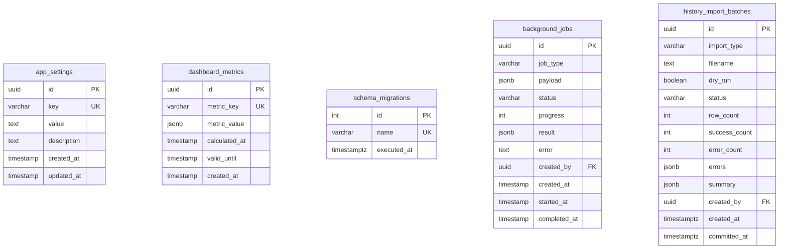

#### `app_settings`

| Column | Type | Keys |
| --- | --- | --- |
| `id` | uuid | PK |
| `key` | varchar(100) | UK |
| `value` | text | — |
| `description` | text? | null |
| `created_at` | timestamp | — |
| `updated_at` | timestamp | — |

#### `dashboard_metrics`

| Column | Type | Keys |
| --- | --- | --- |
| `id` | uuid | PK |
| `metric_key` | varchar(100) | UK |
| `metric_value` | jsonb | — |
| `calculated_at` | timestamp | — |
| `valid_until` | timestamp | — |
| `created_at` | timestamp | — |

#### `schema_migrations`

| Column | Type | Keys |
| --- | --- | --- |
| `id` | int | PK |
| `name` | varchar | UK |
| `executed_at` | timestamptz | — |

#### `background_jobs`

| Column | Type | Keys |
| --- | --- | --- |
| `id` | uuid | PK |
| `job_type` | varchar(100) | — |
| `payload` | jsonb | — |
| `status` | varchar(30) | — |
| `progress` | int | — |
| `result` | jsonb? | null |
| `error` | text? | null |
| `created_by` | uuid? | FK, null |
| `created_at` | timestamp | — |
| `started_at` | timestamp? | null |
| `completed_at` | timestamp? | null |

#### `history_import_batches`

| Column | Type | Keys |
| --- | --- | --- |
| `id` | uuid | PK |
| `import_type` | varchar(50) | — |
| `filename` | text? | null |
| `dry_run` | boolean | — |
| `status` | varchar(20) | — |
| `row_count` | int | — |
| `success_count` | int | — |
| `error_count` | int | — |
| `errors` | jsonb | — |
| `summary` | jsonb | — |
| `created_by` | uuid? | FK, null |
| `created_at` | timestamptz | — |
| `committed_at` | timestamptz? | null |


## Table inventory

### Prisma models (`prisma/schema.prisma`)

| Table | Domain |
| --- | --- |
| `users` | Identity |
| `tenants` | People |
| `contacts` | People |
| `contact_roles` | People |
| `buildings` | Property |
| `rooms` | Property |
| `tenant_room_assignments` | Occupancy / lease |
| `invoices` | Billing |
| `invoice_line_items` | Billing |
| `payments` | Billing |
| `payment_allocations` | Billing |
| `tenant_credits` | Billing |
| `deposit_ledger` | Deposits (legacy) |
| `expenses` | Financial |
| `assets` | Assets |
| `asset_assignments` | Assets |
| `asset_billing` | Assets |
| `documents` | Documents |
| `document_categories` | Documents |
| `images` | Documents (polymorphic) |
| `utility_bills` | Utilities |
| `tenant_utility_bills` | Utilities |
| `utility_meter_readings` | Utilities |
| `utility_allocation_rules` | Utilities |
| `utility_unit_groups` | Utilities |
| `utility_unit_group_members` | Utilities |
| `utility_bill_unit_splits` | Utilities |
| `cost_allocation_history` | Utilities |
| `pipeline_boards` | CRM / tasks |
| `pipeline_stages` | CRM / tasks |
| `pipeline_cards` | CRM / tasks |
| `pipeline_card_events` | CRM / tasks |
| `communications` | Comms |
| `notifications` | Comms |
| `audit_logs` | Audit |
| `collection_lifetime_totals` | Reporting |
| `collection_lifetime_period_commits` | Reporting |
| `schema_migrations` | System |

### SQL-only tables (`migrations/*.sql`)

| Table | Domain |
| --- | --- |
| `lease_package_templates` | Leasing (commercial terms) |
| `lease_templates` | Leasing (wording CMS) |
| `lease_template_sections` | Leasing |
| `lease_agreement_snapshots` | Leasing |
| `lease_signature_events` | Leasing |
| `lease_renewal_requests` | Leasing |
| `lease_expiration_alerts` | Leasing |
| `moveout_processing` | Move-out |
| `moveout_inspection_checklist_templates` | Move-out |
| `moveout_inspection_items` | Move-out |
| `occupants` | Occupancy |
| `reservations` | Occupancy |
| `building_deposit_config` | Property |
| `payment_updates` | Billing |
| `late_fee_settings` | Late fees |
| `late_fee_applications` | Late fees |
| `late_fee_tiers` | Late fees |
| `txn_sequences` | Billing IDs |
| `maintenance_requests` | Maintenance |
| `maintenance_request_updates` | Maintenance |
| `maintenance_request_attachments` | Maintenance |
| `maintenance_update_reactions` | Maintenance |
| `entity_notes` | Notes (polymorphic) |
| `activity_log` | Audit |
| `notification_preferences` | Comms |
| `notification_templates` | Email |
| `notification_settings` | Email |
| `notification_queue` | Email |
| `notification_history` | Email |
| `scheduled_reminders` | Email |
| `building_nearby_snapshots` | Maps |
| `building_nearby_routes` | Maps |
| `address_regions` | Address lookup |
| `address_cities` | Address lookup |
| `app_settings` | Config |
| `admin_home_stickies` | Admin UI |
| `password_reset_tokens` | Auth |
| `background_jobs` | Jobs |
| `dashboard_metrics` | Reporting (unused; dashboards compute live) |
| `history_import_batches` | Imports |

---

## Reading notes

- **~40 tables in Prisma**, **~45 more only in SQL migrations.** Prisma does not model leases, maintenance, occupants, reservations, late fees, or the email queue.
- **Lease = assignment.** Admin leases, renewals, and move-outs hang off `tenant_room_assignments`.
- **Two lease template types:** `lease_templates` = document wording / e-sign CMS; `lease_package_templates` = commercial terms (term, deposit, penalty).
- **One live deposit table:** `deposit_ledger` (singular). Phase-1 `deposit_ledgers` + `deposit_transactions` were dropped.
- **Polymorphic (no FK):** `images`, `entity_notes`, `activity_log` (`entity_type` + `entity_id`).
- **Address lookup** (`address_regions` / `address_cities`) is not FK’d to `buildings`; buildings still store city/state as strings.
- **`expenses.related_moveout_id`** is a loose column; there is no Prisma relation to `moveout_processing`.
- **People directory ≠ `contacts`.** `/admin/people` lists `tenants`. `contacts` is the vendor/staff picker on expense and utility forms.
- **Dropped / unused:** `communications`, `asset_billing`, and `dashboard_metrics` exist in schema but have no page CRUD. `/admin/analytics` still SQL-joins a nonexistent `leases` table.

---

## Page alignment

How sidebar / tenant screens map to tables. “Name differs” means the ERD table is correct but the UI label is not the table name.

| Page | Path | Tables | Fit |
| --- | --- | --- | --- |
| Home | `/admin` | `admin_home_stickies` + invoices/payments/assignments | Aligned |
| Tasks | `/admin/tasks` | `pipeline_boards`, `pipeline_stages`, `pipeline_cards`, `pipeline_card_events` | Name differs (no `tasks` table) |
| Properties / rooms | `/admin/properties`, `/admin/rooms` | `buildings`, `rooms`, `images`, assignments, occupants | Aligned |
| Tenants | `/admin/tenants` | `tenants`, `tenant_room_assignments`, `users` | Aligned |
| People | `/admin/people` | `tenants` + occupancy joins | Name differs (not `contacts`) |
| Leasing packages | `/admin/leasing` | `lease_package_templates` | Aligned |
| Lease management | `/admin/lease-management` | `tenant_room_assignments` (API: `/api/leases`) | Name differs |
| Lease designer | `/admin/documents/lease-designer` | `lease_templates`, `lease_template_sections` | Aligned |
| Documents | `/admin/documents` | `documents`, `document_categories`, `entity_notes` | Aligned |
| Payments / invoices | `/admin/financial/payments`, `…/invoices` | `payments`, `invoices`, `payment_allocations`, `payment_updates` | Aligned |
| Expenses | `/admin/financial/expenses` | `expenses`; vendor picker = `contacts` | Aligned |
| Late fees | `/admin/financial/late-fees/*` | `late_fee_settings`, `late_fee_tiers`, `late_fee_applications` | Aligned |
| Utility bills / groups | `/admin/bills-expenses/*` | `utility_bills`, `utility_unit_groups`, members, splits | Aligned |
| Meter / allocation | `/admin/utilities/*` | `utility_meter_readings`, `utility_allocation_rules`, `tenant_utility_bills` | Aligned |
| Assets | `/admin/assets` | `assets`, `asset_assignments` | Aligned (`asset_billing` unused) |
| Maintenance | `/admin/maintenance`, `/tenant/maintenance` | `maintenance_requests` + updates/attachments/reactions | Aligned |
| Collected amount | `/admin/reports/collected-amount` | `payments`, `collection_lifetime_totals`, `collection_lifetime_period_commits` | Aligned |
| Deposits report | `/admin/reports/deposits` | `deposit_ledger` | Aligned |
| Analytics | `/admin/analytics` | mixed + **broken `FROM leases`** | Wrong SQL |
| Settings / gateways | `/admin/settings` | `app_settings` | Aligned |
| Activity | `/admin/activity` | `activity_log` (legacy API still hits `audit_logs`) | Name differs |
| Users / auth | `/admin/users`, `/auth/*` | `users`, `password_reset_tokens` | Aligned |
| Reservations | `/admin/tenants/reservations` | `reservations` | Aligned |
| Landing | `/` | `buildings`, `rooms`, `images`, `building_nearby_*` | Aligned |
| Tenant portal | `/tenant/*` | tenants, assignments, invoices, payments, maintenance, documents, occupants | Aligned |
| Export / advanced analytics | `/admin/export`, `…/advanced-analytics` | none (mock) | No table |

### Columns pages use that the boxed diagrams omit

- `tenants.is_tenant`, `tenants.profile_picture_url`, `tenants.tenant_agreement_document_id`
- `tenant_room_assignments.advance_paid`, `utility_deposit_paid`, `lease_package_template_id`
- `pipeline_cards.lease_package_template_id`
- `buildings.show_on_landing_nearby`, `buildings.auto_late_fee`
