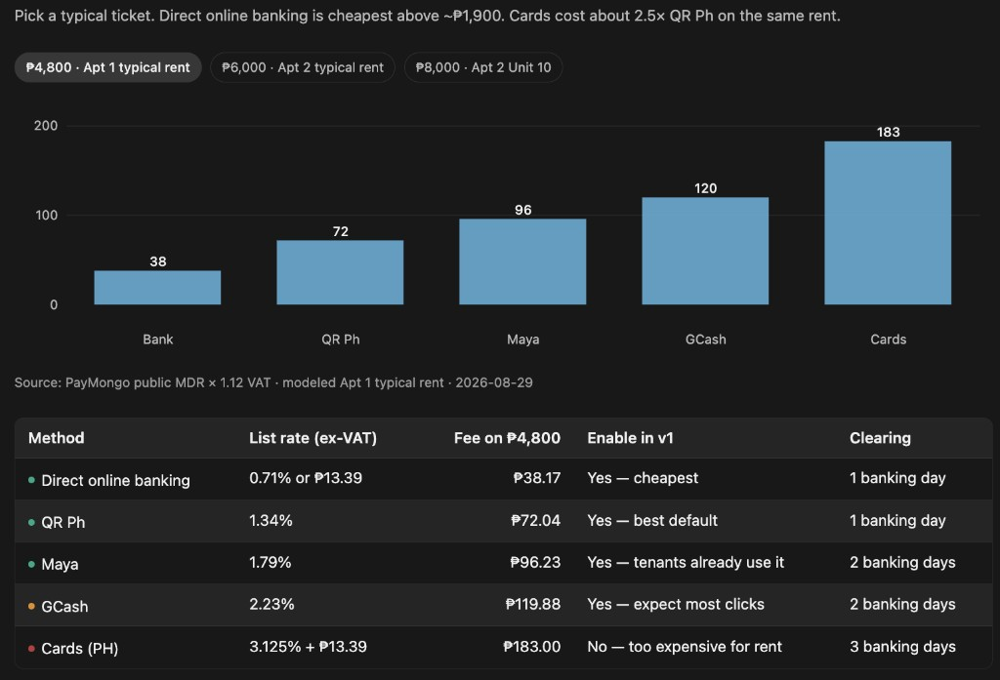

# PayMongo for Parenta — fee brief for the client

**One payment. How much is the fee?**

PayMongo has **no setup fee** and **no monthly fee**. You only pay when a tenant pays through it.

Most tenants will use GCash. On a typical Apt 1 rent of **₱4,800**, that fee is about **₱120**.

---

## Recommendation

Keep today’s GCash / Maya / bank + screenshot path (no gateway fee, money is instant).

Add PayMongo as an optional **Pay now** button so the payment posts automatically — no receipt, no office confirm.

- **Pass the fee to the tenant**, so the office still receives full rent.
- **Turn on:** bank, QR Ph, Maya, GCash.
- **Do not turn on:** cards (too expensive for rent).

---

## Fee on one ₱4,800 rent payment

Typical Apt 1 unit. Fees include 12% VAT.



```mermaid
xychart-beta
    title Fee on ₱4,800 rent (PHP, incl. VAT)
    x-axis [Bank, "QR Ph", Maya, GCash, Cards]
    y-axis "Fee (PHP)" 0 --> 200
    bar [38, 72, 96, 120, 183]
```

| Method | Rate (ex-VAT) | **Fee on ₱4,800** | Office receives | Clearing | Use it? |
| --- | --- | ---: | ---: | --- | --- |
| Direct online banking | 0.71% or ₱13.39 | **₱38.17** | ₱4,761.83 | 1 banking day | Yes — cheapest |
| QR Ph | 1.34% | **₱72.04** | ₱4,727.96 | 1 banking day | Yes — best default |
| Maya | 1.79% | **₱96.23** | ₱4,703.77 | 2 banking days | Yes |
| GCash | 2.23% | **₱119.88** | ₱4,680.12 | 2 banking days | Yes — most tenants |
| Cards (PH Visa / Mastercard) | 3.125% + ₱13.39 | **₱183.00** | ₱4,617.00 | 3 banking days | **No** |

**How to read this:** if the office absorbs the fee, rent of ₱4,800 via GCash becomes ₱4,680 in the account. If the tenant pays the fee, they pay ₱4,920 on GCash and the office still gets ₱4,800.

---

## Same chart, other typical rents

### ₱6,000 — Apt 2 typical rent

```mermaid
xychart-beta
    title Fee on ₱6,000 rent (PHP, incl. VAT)
    x-axis [Bank, "QR Ph", Maya, GCash, Cards]
    y-axis "Fee (PHP)" 0 --> 250
    bar [48, 90, 120, 150, 225]
```

| Method | Fee | Office receives |
| --- | ---: | ---: |
| Bank | ₱47.71 | ₱5,952.29 |
| QR Ph | ₱90.05 | ₱5,909.95 |
| Maya | ₱120.29 | ₱5,879.71 |
| GCash | ₱149.86 | ₱5,850.14 |
| Cards | ₱225.00 | ₱5,775.00 |

### ₱8,000 — Apt 2 Unit 10

```mermaid
xychart-beta
    title Fee on ₱8,000 rent (PHP, incl. VAT)
    x-axis [Bank, "QR Ph", Maya, GCash, Cards]
    y-axis "Fee (PHP)" 0 --> 320
    bar [64, 120, 160, 200, 295]
```

| Method | Fee | Office receives |
| --- | ---: | ---: |
| Bank | ₱63.62 | ₱7,936.38 |
| QR Ph | ₱120.06 | ₱7,879.94 |
| Maya | ₱160.38 | ₱7,839.62 |
| GCash | ₱199.81 | ₱7,800.19 |
| Cards | ₱295.00 | ₱7,705.00 |

---

## Two ways to collect (recommended: both)

| | Today (keep) | PayMongo (add) |
| --- | --- | --- |
| How tenant pays | GCash / Maya / bank to the office number, then upload a screenshot | Clicks **Pay now** and pays on PayMongo |
| Gateway fee | **₱0** | ~₱38–₱120 per payment, depending on method |
| When money arrives | Instant (already in your GCash / bank) | 1–3 banking days, then payout |
| Office work | Confirm each receipt | Payment posts automatically |

The screenshot path stays for tenants who do not want a convenience fee, and for days you need the money immediately.

---

## If the office absorbs the fee (whole building)

Modeled on Apt 1 + Apt 2 occupied rents: about **₱173,500 / month**, **34 payments**.

| If every tenant paid this way | Cost per month (incl. VAT) |
| --- | ---: |
| Screenshot path only (today) | **₱0** |
| All via bank | ₱1,380 |
| All via QR Ph | ₱2,604 |
| All via GCash | **₱4,333** |
| All via cards | ₱6,582 |
| Tenant pays the fee (recommended) | **₱0 to the office** |

---

## Decision for the client

1. **Yes to PayMongo** as an optional Pay now button — automatic posting, less receipt checking.
2. **Pass the fee to the tenant** so rent received stays ₱4,800 / ₱6,000 / ₱8,000.
3. **Do not enable cards.** On ₱4,800 rent the card fee is ₱183 vs ₱38 for bank.
4. **Keep GCash-to-your-number.** It is still the cheapest and fastest path.

---

*Rates from [PayMongo pricing](https://www.paymongo.com/pricing), exclusive of VAT. This brief adds 12% VAT. Modeled 29 Aug 2026. Actual billed fee is set by PayMongo at checkout.*
